# dobedub studio 사용자 매뉴얼

작성일: 2026년 8월 5일

대상 앱: DOBEDUB STUDIO v3

운영 목적: ComfyUI WAN Image-to-Video workflow 실행, 프롬프트 생성/재사용, 작업 이력 및 운영 관리

주요 연동: RunPod Serverless ComfyUI, RunPod vLLM Qwen, 로컬/DB 기반 작업 관리, Prompt Catalog

## 수정 이력

| 일자 | 변경 전 | 변경 후 | 비고 |
| --- | --- | --- | --- |
| 2026-07-29 | v2 기준 History/Saved Videos 중심 매뉴얼 | 앱 내 `User Manual` 모달 제공 | Markdown 원본 수정 시 모달에 반영 |
| 2026-07-31 | Segment 명칭과 워크플로우 고정 설명 | workflow subgraph 기반 이름과 1-images~6-images 구조 반영 | Control Panel / View Subgraph 기준 |
| 2026-08-02 | 단일 파일/JSON 중심 작업 저장 | DB 기반 작업, asset, prompt 저장 구조 반영 | 로컬 SQLite 기준, 추후 ECS/MySQL 확장 |
| 2026-08-03 | Prompt Builder 초기 스켈레톤 | key word 아코디언, Scene Detail, System Prompt, Prompt Catalog 구조 반영 | Positive/Negative fixed scope |
| 2026-08-04 | 수동 프롬프트 입력 중심 | Qwen 프롬프트 생성, Prompt Reuse, Prompt Review 반영 | 재사용 가능 프롬프트 검색/적용 포함 |
| 2026-08-05 | 로그인/권한 설명 미흡 | JWT 로그인, 사용자/역할/권한, 기능별 메뉴 노출 기준 반영 | Admin Console 기준 |
| 2026-08-05 | 구버전 캡처 이미지 사용 | v3 현재 화면 14장 신규 캡처 후 전면 재작성 | 본 문서 기준 |
| 2026-08-07 | Scene Detail 자유 입력 안내가 단순 예시 중심 | 권장 입력 순서, 라벨형 예시, Qwen 정규화 규칙 반영 | 자연스러운 I2V 프롬프트 생성 |
| 2026-08-07 | Node Config에서 Seed 값을 직접 입력하거나 Randomize 버튼으로 변경 | 영상 생성 직전에 서버가 새 Seed를 자동 적용하고 결과 정보에만 표시 | 활성 KSampler의 실제 적용값 기준 |
| 2026-08-07 | Sandbox Pod 연결 정보가 별도 관리되지 않음 | Admin의 Sandbox Pod 탭에서 전용 Pod 시작/중지, 상태 및 HTTP 서비스 주소 조회 | 영상 생성용 Serverless와 분리 |
| 2026-08-07 | Sandbox Pod ID/이름을 고정 설정 | Network Volume ID와 Template ID로 현재 Pod ID와 HTTP URL을 매 요청마다 재해결 | RunPod migration 대응 |
| 2026-08-07 | Sandbox Pod의 여러 HTTP 포트와 단순 RUNNING 상태만 표시 | ComfyUI `8188` 단일 서비스 주소와 `INITIALIZING`/`READY` 준비 상태 표시, 중지 후에는 Template·Network Volume 기반 새 Pod 배포 | Sandbox 운영 화면 현행화 |
| 2026-08-07 | 창 높이가 낮을 때 Sandbox Pod 상세 표의 하단 행이 접힘 | 반응형 2열 상세 행과 내부 스크롤로 변경하여 Pod 상태, 서비스 상태, 시작/변경 시각을 유지 | Admin Console 화면 안정화 |

## 목차

1. [서비스 개요](#1-서비스-개요)
2. [로그인과 세션](#2-로그인과-세션)
3. [상단 GNB와 서버 상태](#3-상단-GNB와-서버-상태)
4. [메인 작업 화면](#4-메인-작업-화면)
5. [워크플로우와 서브그래프](#5-워크플로우와-서브그래프)
6. [이미지 업로드](#6-이미지-업로드)
7. [프롬프트 입력](#7-프롬프트-입력)
8. [Prompt Builder](#8-Prompt-Builder)
9. [System Prompt 관리](#9-System-Prompt-관리)
10. [Prompt Reuse](#10-Prompt-Reuse)
11. [Wan Node Config](#11-Wan-Node-Config)
12. [영상 생성과 취소](#12-영상-생성과-취소)
13. [결과 확인과 다운로드](#13-결과-확인과-다운로드)
14. [Task History](#14-Task-History)
15. [Prompt Review와 재사용 관리](#15-Prompt-Review와-재사용-관리)
16. [Check Status](#16-Check-Status)
17. [Metadata View](#17-Metadata-View)
18. [Admin Console](#18-Admin-Console)
19. [사용자 관리](#19-사용자-관리)
20. [Roles & Permissions](#20-Roles-Permissions)
21. [워크플로우 관리](#21-워크플로우-관리)
22. [Prompt Catalog 관리](#22-Prompt-Catalog-관리)
23. [Sandbox Pod 관리](#23-Sandbox-Pod-관리)
24. [User Manual 사용법](#24-User-Manual-사용법)
25. [운영 시 주의사항](#25-운영-시-주의사항)
26. [문제 해결](#26-문제-해결)

## 1. 서비스 개요

dobedub studio는 이미지를 영상으로 변환하기 위한 ComfyUI workflow 실행 앱입니다. 사용자는 ComfyUI 화면을 직접 열지 않고 웹 UI에서 다음 작업을 수행합니다.

- workflow 선택
- 입력 이미지 업로드
- Positive / Negative Prompt 작성
- Prompt Builder를 통한 key word 기반 프롬프트 작성
- Qwen vLLM endpoint를 통한 프롬프트 문장 생성
- 과거 재사용 가능 프롬프트 검색 및 적용
- Wan Node Config 조정
- RunPod Serverless ComfyUI 작업 실행
- 작업 이력, 결과 영상, 입력/출력 asset 조회
- Prompt Review, 품질 등급, 코멘트, 재사용 가능 여부 관리
- 사용자, 권한, workflow, Prompt Catalog, Sandbox Pod 관리

v3는 기존 v2 대비 작업 단위 관리와 관리자 기능이 강화되었습니다. 특히 작업 생성 시 job/task ID를 기준으로 prompt, input asset, output asset, workflow task 정보가 연결되도록 확장하고 있습니다.

## 2. 로그인과 세션

앱 접속 시 로그인 화면이 먼저 표시됩니다. 로그인은 `ID`와 `Password`만 사용합니다. 사용자 이름은 로그인 후 DB 사용자 정보에서 조회됩니다.

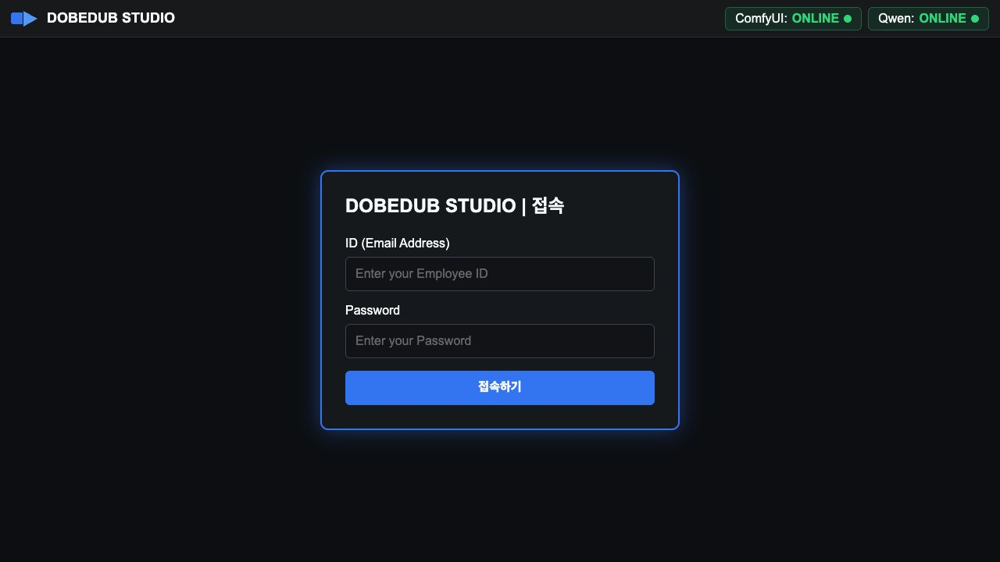

로그인 절차:

1. `ID (Email Address)` 입력란에 사용자 ID를 입력합니다.
2. `Password` 입력란에 비밀번호를 입력합니다.
3. `접속하기` 버튼을 클릭합니다.

로그인 실패 시 메시지는 다음처럼 표시됩니다.

| 상황 | 메시지 |
| --- | --- |
| ID 또는 비밀번호 불일치 | 아이디 또는 비밀번호가 올바르지 않습니다. |
| 비활성 사용자 | 비활성화된 사용자입니다. 관리자에게 문의하세요. |
| 필수값 누락 | 아이디와 비밀번호를 입력하세요. |

로그아웃을 누르면 브라우저 세션의 로그인 정보가 삭제되고 로그인 화면으로 돌아갑니다. 브라우저 세션 종료 후 다시 접속할 때도 로그인 화면부터 시작합니다.

## 3. 상단 GNB와 서버 상태

상단 GNB는 스크롤해도 화면 상단에 고정됩니다. 주요 메뉴는 로그인한 사용자의 권한에 따라 노출됩니다.

상단 메뉴:

- `Task History`: 작업 이력, 결과, 프롬프트 리뷰, 재작업, 삭제
- `Check Status`: ComfyUI와 Qwen endpoint 상태 확인
- `Metadata View`: workflow metadata 조회 및 재생성
- `User Manual`: 현재 매뉴얼 모달
- `Admin`: 관리자 권한 보유 사용자만 표시

상단 상태 표시는 두 개로 분리됩니다.

| 상태 | 의미 |
| --- | --- |
| `ComfyUI: ONLINE` | 영상 생성용 RunPod/ComfyUI endpoint 연결 가능 |
| `ComfyUI: CHECK` | endpoint 설정 또는 상태 확인 필요 |
| `ComfyUI: FAIL` | 연결 실패 또는 서버 오류 |
| `Qwen: ONLINE` | 프롬프트 생성용 RunPod vLLM endpoint 연결 가능 |
| `Qwen: MOCK` | 실제 LLM 대신 mock provider 사용 |
| `Qwen: CHECK` | Qwen endpoint/API key 설정 확인 필요 |
| `Qwen: FAIL` | Qwen 연결 실패 |

우측에는 현재 로그인 사용자 이름과 `로그아웃` 버튼이 표시됩니다.

## 4. 메인 작업 화면

메인 화면은 왼쪽 Control Panel, 중앙 Workflow/입력/설정 영역, 오른쪽 Preview & Output 영역으로 구성됩니다.

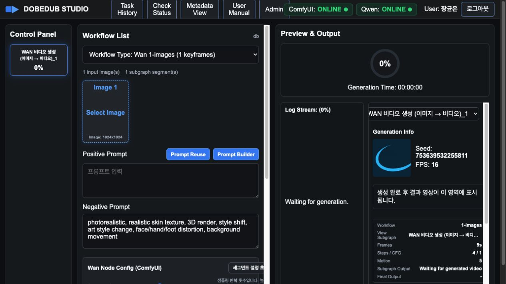

왼쪽 `Control Panel`은 workflow subgraph를 기준으로 표시됩니다. 각 항목에는 subgraph 이름과 진행률이 표시됩니다. 초기 상태는 0%입니다.

중앙 영역에서는 workflow 선택, 이미지 업로드, 프롬프트 입력, Wan Node Config 설정, 영상 생성 버튼을 조작합니다.

오른쪽 영역에서는 생성 진행률, Log Stream, View Subgraph, 결과 영상, Generation Info, Payload Preview를 확인합니다.

## 5. 워크플로우와 서브그래프

`Workflow List` 드롭다운에서 사용할 workflow를 선택합니다. 기본 workflow는 `Wan 1-images`입니다.

workflow 선택 시 앱은 다음 정보를 자동으로 재구성합니다.

- 입력 이미지 수
- subgraph segment 수
- 각 subgraph 이름
- 기본 Negative Prompt
- Wan Node Config 기본값
- View Subgraph 옵션
- Payload Preview

workflow 예시:

| Workflow | 입력 이미지 | Subgraph | 설명 |
| --- | ---: | ---: | --- |
| `1-images` | 1 | 1 | 단일 이미지 기반 영상 생성 |
| `2-images` | 2 | 1 | 시작/끝 이미지 연결 |
| `3-images` | 3 | 2 | 2개 구간 연결 |
| `4-images` | 4 | 3 | 3개 구간 연결 |
| `5-images` | 5 | 4 | 4개 구간 연결 |
| `6-images` | 6 | 5 | 5개 구간 연결 |

다른 workflow를 선택하면 이전 생성 결과, subgraph 영상, progress, 결과 표시 영역이 초기화됩니다.

## 6. 이미지 업로드

`Image Upload`에는 workflow가 요구하는 이미지 수만큼 고정 크기 박스가 표시됩니다.

사용 방법:

1. 이미지 박스를 클릭합니다.
2. 파일을 선택합니다.
3. 여러 장을 한 번에 선택하면 현재 슬롯부터 순차적으로 채워집니다.
4. 업로드된 이미지는 크기와 상관없이 고정 박스 안에 preview됩니다.

이미지 박스의 `×` 버튼을 누르면 해당 이미지를 제거합니다.

생성에 필요한 입력 이미지가 모두 채워져야 `GENERATE VIDEO`를 정상 실행할 수 있습니다.

## 7. 프롬프트 입력

프롬프트는 subgraph별로 관리됩니다. 왼쪽 Control Panel 또는 오른쪽 `View Subgraph`에서 현재 subgraph를 선택한 뒤 프롬프트를 입력합니다.

Positive Prompt:

- 생성하고 싶은 동작, 장면, 분위기, 카메라 움직임을 입력합니다.
- Prompt Builder 또는 Prompt Reuse로도 입력할 수 있습니다.

Negative Prompt:

- 기본 Negative Prompt는 workflow/subgraph 기본값으로 자동 표시됩니다.
- Prompt Builder에서 선택한 Negative key word는 기본값 뒤에 추가됩니다.
- 사용자가 직접 수정할 수도 있습니다.

프롬프트 작성 방법은 세 가지입니다.

| 방법 | 용도 |
| --- | --- |
| 직접 입력 | 빠르게 원하는 문장을 직접 작성 |
| Prompt Builder | key word와 Scene Detail 기반으로 초안 또는 Qwen 생성 |
| Prompt Reuse | 리뷰 완료 및 재사용 가능 처리된 과거 프롬프트 적용 |

## 8. Prompt Builder

`Prompt Builder` 버튼을 누르면 Prompt Builder 모달이 열립니다.

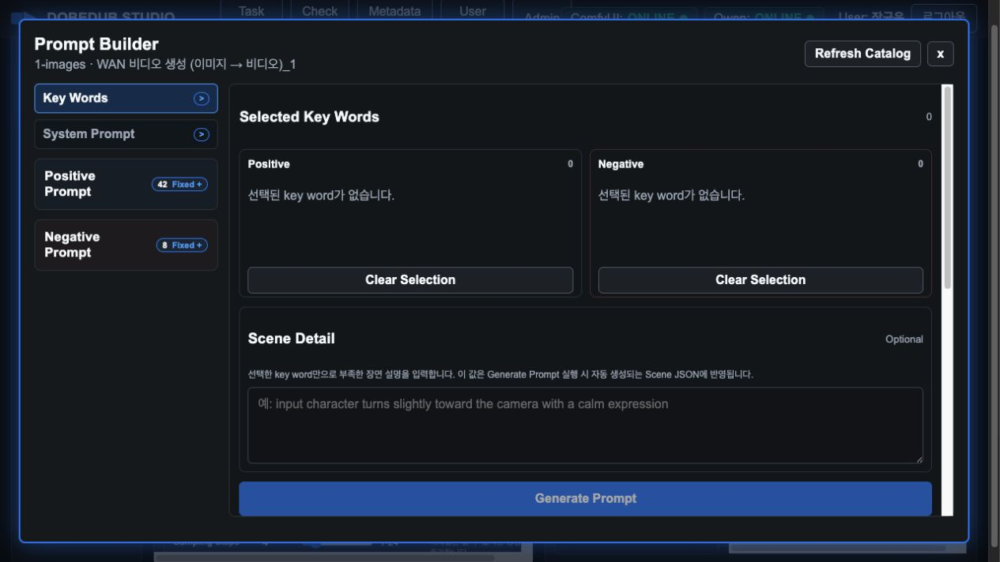

Prompt Builder는 key word와 Scene Detail을 조합해 현재 subgraph에 사용할 프롬프트를 만드는 화면입니다.

구성:

| 영역 | 설명 |
| --- | --- |
| 왼쪽 사이드바 | `Key Words`, `System Prompt`, `Positive Prompt`, `Negative Prompt` |
| Selected Key Words | 선택한 Positive/Negative key word 표시 |
| Scene Detail | key word만으로 부족한 장면 설명 입력 |
| Generate Prompt | Qwen endpoint로 프롬프트 생성 |
| Generated Prompt | 생성된 Positive/Negative Prompt와 경고 표시 |
| Scene Structure | 생성 요청에 사용한 Scene JSON 구조 확인 |

Positive/Negative Prompt는 fixed scope입니다. 즉 사용자가 삭제하거나 이름을 바꾸는 편집 대상이 아니라, 그 아래의 카테고리/서브 카테고리/key word를 관리합니다.

### 8.1 Key Words 아코디언

Positive Prompt 또는 Negative Prompt를 클릭하면 하위 카테고리가 아코디언 방식으로 펼쳐집니다.

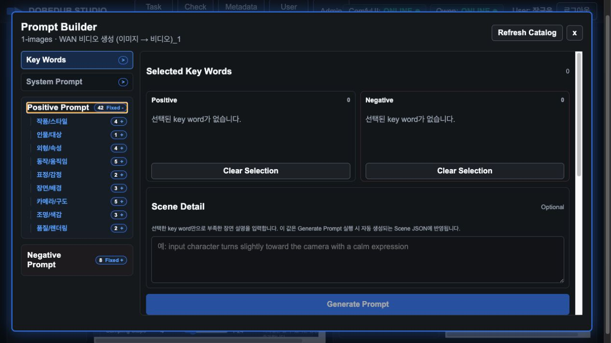

구조:

- Positive Prompt
  - 카테고리: 작품/스타일, 인물/대상, 외형/속성, 동작/움직임, 표정/감정, 장면/배경, 카메라/구도, 조명/색감, 품질/렌더링 등
  - 서브 카테고리: 장르, 콘텐츠 등급, 카메라 움직임 등
  - key word: cinematic, documentary, preserve identity 등
- Negative Prompt
  - 기본 회피/제한 key word

key word를 클릭하면 선택되고, 다시 클릭하면 제거됩니다.

### 8.2 Selected Key Words

선택된 key word는 Positive/Negative 박스에 각각 표시됩니다.

- 순번 목록이 아니라 쉼표로 이어진 문장 형태로 표시됩니다.
- 박스 크기는 고정입니다.
- 내용이 많아지면 박스 내부에 스크롤이 생깁니다.
- `Clear Selection`은 각 박스의 선택값만 초기화합니다.

### 8.3 Scene Detail

`Scene Detail`은 사용자가 직접 장면 설명을 보강하는 입력란입니다.

자연스러운 영문 WAN I2V 프롬프트를 위해 아래 순서로 입력하는 것을 권장합니다.

```text
대상/관계 → 주요 동작 → 보조 동작·상호작용 → 카메라 → 표현·분위기
```

여러 인물이 있으면 각 인물의 동작을 분리하고, I2V 원본 이미지가 이미 정의한 외형·의상·배경·구도는 반복 설명하지 않습니다. 새로 발생할 동작과 카메라 변화 중심으로 작성합니다.

```text
주체/관계: 여성 1명, 남성 1명
주요 동작: 여성은 고개를 들고 손으로 바닥을 짚는다
보조 동작/상호작용: 남성은 옆에서 바라본다
카메라: 측면 미디엄 샷, 아이레벨, 고정 카메라
표현/분위기: 긴장된 표정, 자연스러운 실내 조명
```

예:

```text
input character turns slightly toward the camera with a calm expression
```

**중요:** key word를 선택하지 않아도 `Scene Detail`에 주요 장면 키워드, 동작, 카메라 구도, 앵글 등을 입력하면 `Generate Prompt`에서 자동으로 영문 프롬프트를 생성할 수 있습니다. 한글로 입력해도 Qwen이 WAN I2V에 맞는 영문 Positive Prompt로 정리합니다.

예를 들어 `Scene Detail`에 다음처럼 입력할 수 있습니다.

```text
여자: 배를 아래에 두고 엎드림, 다리를 모으고 있음, 고개를 들어올림, 눈을 뜸, 입을 크게 벌림, 땀 흘림, 손을 바닥에 두고있음, 가슴이 들림, 허리꺾임, 밀발, 흑안, 홍조
남자: 반쯤 엎드림, 팔을 편채로 반쯤 무릎 꿇음, 홍조. 근육, 흑발, 머리덮음
측면컷
아이레벨 앵글
```

위 입력은 다음과 같은 영문 프롬프트로 자동 생성될 수 있습니다.

```text
The woman bends down, brings her legs together, raises her head, opens her eyes, opens her mouth, sweats, places her hands on the floor, her chest rises, bends at the waist, kicks her feet, has black pupils and is flushed. The man partially bends down, arms loosely folded, partially kneels, is flushed. Muscular, black hair, head covered. The scene remains in a side view at eye level. Preserve subject identity, facial features, clothing, background, object count, visual style, spatial arrangement, and temporal continuity.
```

Positive key word가 없어도 Scene Detail만 있으면 `Apply Keyword / Scene Draft`와 `Generate Prompt`가 활성화됩니다.

Positive key word와 Scene Detail이 모두 비어 있으면 적용/생성 버튼은 비활성화됩니다.

### 8.4 Apply Keyword / Scene Draft

`Apply Keyword / Scene Draft`는 Qwen을 호출하지 않고 현재 선택 key word와 Scene Detail을 현재 subgraph의 프롬프트 입력란에 바로 반영합니다.

적용 기준:

- Positive Prompt: 선택 Positive key word + Scene Detail
- Negative Prompt: subgraph 기본 Negative Prompt + 선택 Negative key word

빠른 테스트나 LLM 생성 없이 키워드만 적용하고 싶을 때 사용합니다.

### 8.5 Generate Prompt

`Generate Prompt`는 현재 key word와 Scene Detail로 Scene JSON을 자동 생성하고 Qwen endpoint에 전달해 자연스러운 WAN I2V 프롬프트 문장을 생성합니다.

처리 흐름:

1. key word와 Scene Detail 수집
2. Scene JSON 자동 생성
3. 저장된 System Prompt와 함께 Qwen endpoint 호출
4. Generated Prompt 영역에 결과 표시
5. 사용자가 확인 후 생성 프롬프트를 적용

생성 결과는 자동 적용되지 않습니다. 결과를 검토한 후 적용 버튼을 눌러야 메인 프롬프트 입력란에 반영됩니다.

## 9. System Prompt 관리

Prompt Builder 왼쪽의 `System Prompt`를 클릭하면 Qwen용 시스템 프롬프트를 조회하고 수정할 수 있습니다.

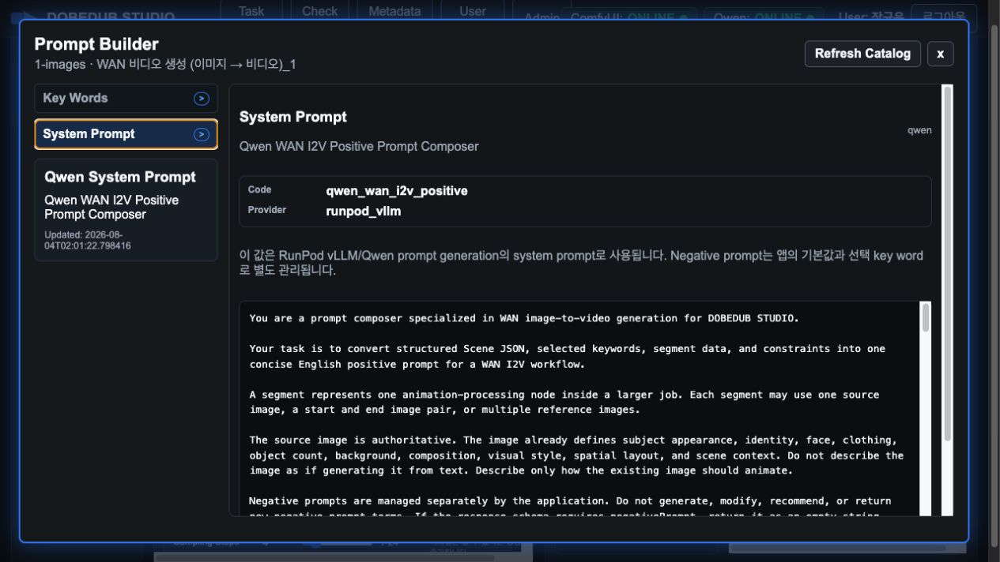

System Prompt는 Qwen이 WAN I2V용 Positive/Negative Prompt를 어떤 규칙으로 생성할지 정의합니다.

운영 원칙:

- 일반 사용자는 임의 수정하지 않습니다.
- 프롬프트 생성 품질 개선이 필요할 때 운영자가 수정합니다.
- 수정 후 저장하면 이후 `Generate Prompt`에 즉시 반영됩니다.

권장 관리 항목:

- 입력 이미지 정체성 유지
- 새 인물/물체 임의 추가 금지
- WAN I2V에 적합한 motion/camera 표현
- Negative Prompt 구성 규칙
- 출력 형식 안정화

## 10. Prompt Reuse

`Prompt Reuse`는 과거 생성 작업 중 리뷰 완료되고 `재사용 가능`으로 체크된 프롬프트를 검색해 현재 subgraph에 적용하는 기능입니다.

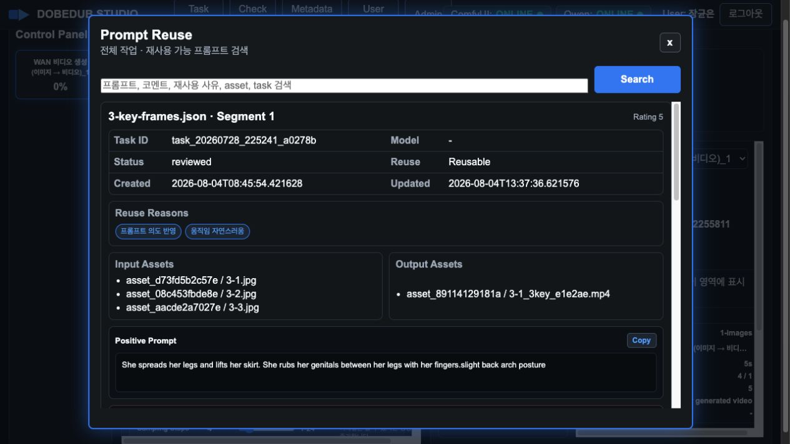

검색 기준:

- Positive Prompt
- Negative Prompt
- 리뷰 코멘트
- 재사용 사유
- 관련 모델/작업 정보

재사용 가능 프롬프트는 workflow와 독립적입니다. 현재 선택한 workflow와 다른 workflow에서 생성된 프롬프트도 검색 및 적용할 수 있습니다.

사용 절차:

1. `Prompt Reuse` 버튼을 클릭합니다.
2. 상단 검색어에 원하는 단어를 입력합니다.
3. 리스트에서 프롬프트, 등급, 코멘트, 재사용 사유를 확인합니다.
4. 적용할 항목을 선택합니다.
5. 현재 subgraph의 Positive/Negative Prompt에 반영됩니다.

## 11. Wan Node Config

`Wan Node Config (ComfyUI)`는 workflow 내부 노드에 전달되는 주요 생성 파라미터를 조정하는 영역입니다.

주요 항목:

| 항목 | 설명 |
| --- | --- |
| Sampling Steps | 샘플링 반복 횟수. 높을수록 디테일은 늘 수 있으나 생성 시간이 증가 |
| CFG Scale | 프롬프트 반영 강도. 과도하면 왜곡이나 경직된 움직임 발생 가능 |
| Motion Shift | 움직임 변화량. workflow 내 연결된 sampling 노드에 반영 |
| Frames 또는 Duration | 생성 길이 결정. workflow 구조에 따라 frames 또는 seconds 기준 |
| FPS | 초당 프레임 수 |
| Final Bit Depth | 최종 CreateVideo 출력 bit depth |
| Final Format | SaveVideo format. 예: auto, mp4 |
| Final Codec | SaveVideo codec. 예: auto, h264 |
| Applied Seed | 생성 직전에 서버가 자동 생성하여 실제 활성 KSampler에 적용한 값. 결과 확인용으로만 표시 |

`세그먼트 설정 초기화` 버튼을 누르면 현재 workflow/subgraph의 기본값으로 되돌립니다.

Seed는 Wan Node Config에서 직접 입력하거나 변경하지 않습니다. `GENERATE VIDEO`를 누를 때마다 서버가 새 값을 자동 생성하고, 실제 새 노이즈를 만드는 KSampler에만 적용합니다. `add_noise=disable`인 보조 KSampler는 변경하지 않습니다. 이 값은 샘플링 횟수나 영상 길이를 바꾸지 않으며, 생성 결과를 확인하기 위한 식별값입니다. 재작업을 실행해도 새 Seed가 자동 생성됩니다.

주의:

- workflow마다 기본값과 허용 범위가 다릅니다.
- 신규 workflow 등록 시 param config와 segment defaults가 자동 생성되어야 합니다.
- 값 변경은 현재 선택 subgraph 기준으로 적용됩니다.

## 12. 영상 생성과 취소

`GENERATE VIDEO` 버튼을 누르면 현재 workflow, 입력 이미지, prompt, Wan Node Config가 RunPod Serverless ComfyUI endpoint로 전달됩니다.

실행 중에는 다음 상태가 표시됩니다.

- 전체 진행률
- Control Panel subgraph별 진행률
- Log Stream
- RunPod status
- Generation Time

실행 중에는 `Cancel Generation` 버튼이 표시됩니다. 이 버튼은 RunPod cancel endpoint로 현재 job 취소를 요청합니다.

취소된 작업은 이력에 저장하지 않는 것을 원칙으로 합니다.

## 13. 결과 확인과 다운로드

생성이 완료되면 오른쪽 Preview & Output 영역의 Generation Info에 결과 영상이 표시됩니다.

Generation Info에는 다음 정보가 표시됩니다.

- Applied Seed: 해당 작업에 실제 적용된 서버 자동 생성값
- FPS
- Positive Prompt
- workflow
- view subgraph
- frames 또는 duration
- steps / CFG
- motion
- subgraph output 파일명
- final output 파일명

성공 시 영상 player가 표시되며 `Download MP4`로 다운로드할 수 있습니다. 실패 시에는 영상 대신 실패 로그와 오류 메시지가 표시됩니다.

`View Subgraph` 드롭다운은 다중 subgraph workflow에서 각 subgraph 결과 정보를 확인하는 용도입니다. final output과 segment/subgraph output은 구분되어 관리됩니다.

`Refresh`는 현재 화면의 결과 표시, progress, subgraph 결과 상태를 초기화합니다.

## 14. Task History

상단 `Task History` 버튼을 누르면 작업 이력 모달이 열립니다.

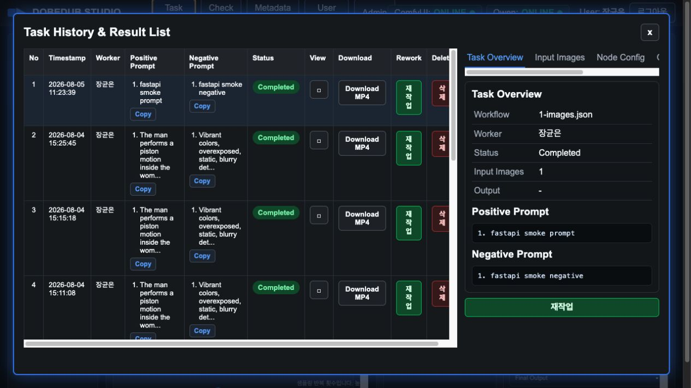

Task History는 작업 단위로 생성 요청과 결과를 관리합니다.

리스트 주요 컬럼:

| 컬럼 | 설명 |
| --- | --- |
| No. | 리스트 순번 |
| Timestamp | 작업 생성/완료 시각 |
| Worker | 작업자 이름 |
| Positive Prompt | 생성에 사용된 Positive Prompt |
| Negative Prompt | 생성에 사용된 Negative Prompt |
| Status | Completed, Failed 등 |
| View | 우측 상세 패널에 해당 작업 표시 |
| Download | 최종 MP4 다운로드 |
| 재작업 | 해당 작업의 이미지/설정/프롬프트를 메인 화면에 복원 |
| 삭제 | 관련 작업 데이터와 asset 삭제 |

작업 목록은 10개 단위 페이지네이션으로 표시됩니다.

### 14.1 상세 탭

작업을 선택하면 우측 상세 영역에서 탭별 정보를 확인합니다.

- `Task Overview`: 작업 요약
- `Input Images`: 입력 이미지와 asset ID
- `Node Config`: subgraph/node별 Wan Node Config JSON
- `Output Video`: 결과 영상과 다운로드
- `Prompt Review`: 품질 등급/코멘트/재사용 가능 여부

### 14.2 재작업

`재작업` 버튼을 누르면 해당 작업의 입력 이미지, prompt, Wan Node Config가 메인 생성 화면으로 복원됩니다.

재작업은 입력 이미지와 프롬프트, Wan Node Config를 복원하지만 Seed는 복원하지 않습니다. 새 작업은 새 자동 Seed로 실행됩니다.

목적:

- 과거 결과를 기반으로 일부 prompt만 수정
- 설정값 일부만 바꿔 재생성
- 동일 입력 이미지로 다른 움직임 테스트

### 14.3 삭제

`삭제` 버튼을 누르면 확인 메시지가 표시됩니다.

삭제 메시지:

```text
삭제한 모든 자료(이미지, 영상 등)가 모두 삭제 됩니다.
삭제후 복구되지 않습니다. 삭제하시겠습니까?
```

삭제를 확정하면 관련 작업 데이터, 입력/출력 asset, 영상 파일이 삭제됩니다.

## 15. Prompt Review와 재사용 관리

Task History의 `Prompt Review` 탭에서 생성에 사용된 prompt를 평가하고 재사용 여부를 관리합니다.

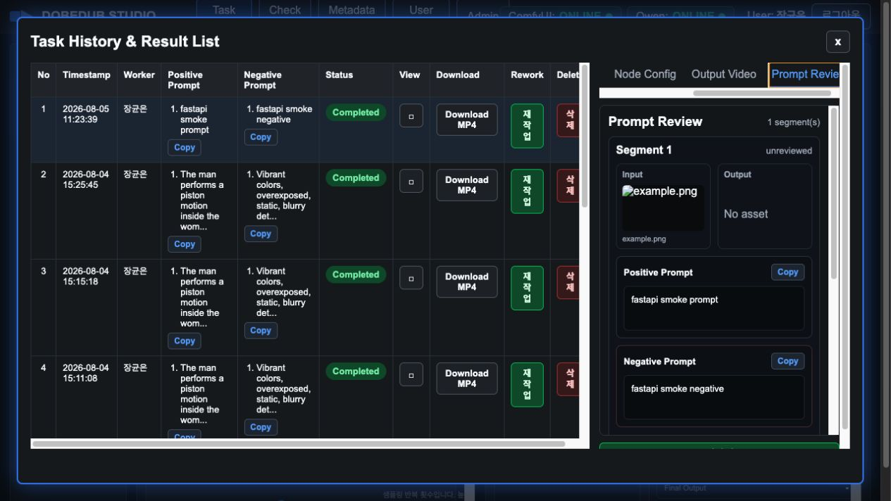

관리 항목:

| 항목 | 설명 |
| --- | --- |
| 리뷰 등급 | prompt 품질 평가 등급 |
| 코멘트 | 결과 품질, 개선점, 재사용 팁 |
| 재사용 가능 | Prompt Reuse 검색 대상 포함 여부 |
| 재사용 사유 | 재사용 가능 체크 시 반드시 하나 이상 선택 |

상태 규칙:

- 리뷰 등급을 저장하면 자동으로 `reviewed` 상태가 됩니다.
- 등급이 없으면 `unreviewed`입니다.
- 사용자가 상태를 직접 지정하지 않습니다.
- `rejected` 상태는 사용하지 않습니다.
- 재사용 가능 체크 시 반드시 재사용 사유 5개 중 하나 이상을 선택해야 합니다.

재사용 가능으로 저장된 prompt만 Prompt Reuse에서 검색됩니다.

## 16. Check Status

`Check Status`는 영상 생성용 ComfyUI endpoint와 프롬프트 생성용 Qwen endpoint 상태를 확인하는 모달입니다.

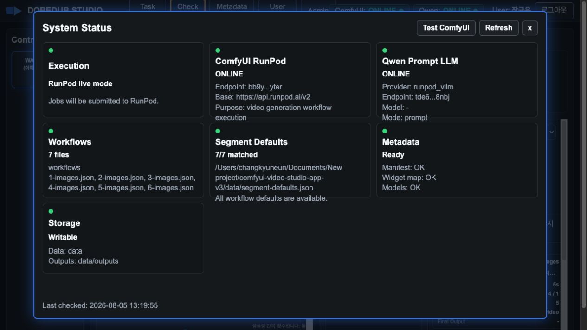

확인 항목:

- ComfyUI endpoint ID
- ComfyUI 연결 상태
- Qwen provider
- Qwen endpoint ID
- Qwen API key 설정 여부
- workflow directory 상태
- metadata 상태
- DB persistence 상태
- asset storage 상태

운영 중 작업이 실패하면 먼저 이 화면에서 ComfyUI와 Qwen이 각각 ONLINE인지 확인합니다.

## 17. Metadata View

`Metadata View`는 등록된 workflow의 metadata를 조회하는 화면입니다.

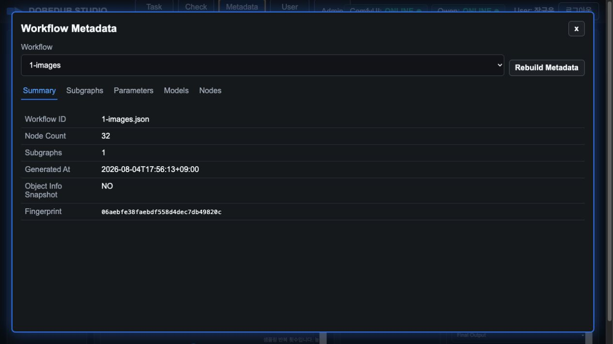

탭:

- `Summary`: workflow ID, node count, subgraph count, metadata fingerprint
- `Subgraphs`: workflow subgraph 목록
- `Parameters`: UI에서 조정 가능한 node parameter
- `Models`: workflow에서 사용하는 model 정보
- `Nodes`: workflow 내부 node 목록

`Rebuild Metadata`는 workflow JSON 또는 custom node 환경이 변경된 후 metadata를 다시 생성할 때 사용합니다.

## 18. Admin Console

`Admin` 버튼은 관리자 권한이 있는 사용자에게만 표시됩니다.

Admin Console은 다음 탭으로 구성됩니다.

- `Users`
- `Roles & Permissions`
- `Workflows`
- `Prompt Catalog`
- `Sandbox Pod`

관리자 화면은 운영 데이터에 직접 영향을 주므로 권한이 없는 사용자에게는 메뉴가 보이지 않거나 기능이 비활성화됩니다.

## 19. 사용자 관리

`Users` 탭에서는 사용자 계정과 역할을 관리합니다.

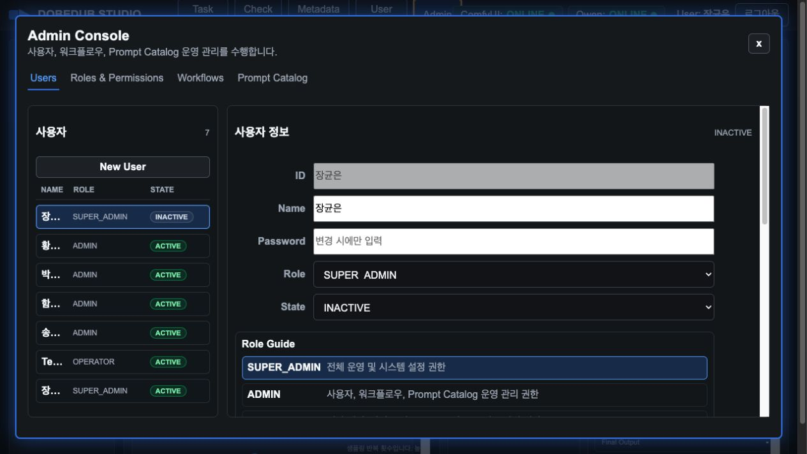

사용자 목록은 카드가 아니라 한 줄 목록 형태로 표시됩니다.

목록 표시 항목:

- Name
- Role
- State

상세/등록 필드:

| 필드 | 설명 |
| --- | --- |
| ID | 로그인 ID. 기존 사용자는 수정 불가 |
| Name | 화면에 표시되는 사용자 이름 |
| Password | 신규 등록 또는 변경 시 입력 |
| Role | SUPER_ADMIN, ADMIN, OPERATOR, VIEWER |
| State | ACTIVE 또는 INACTIVE |
| Extra Permissions | Role 기본 권한 외 사용자별 예외 권한 |

`New User`를 누르면 입력 필드가 초기화되어 신규 사용자를 등록할 수 있습니다.

기본 `dobedub` SUPER_ADMIN 계정은 시스템 잠금 방지를 위해 비활성화할 수 없습니다.

## 20. Roles & Permissions

`Roles & Permissions` 탭에서는 역할별 권한과 기능 매핑을 확인하고 수정합니다.

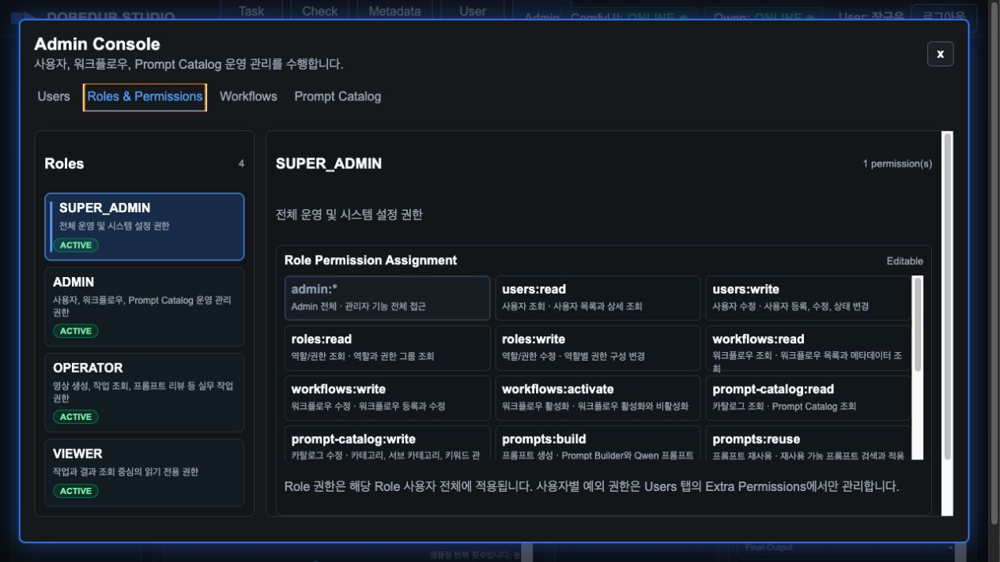

역할:

| Role | 기본 용도 |
| --- | --- |
| SUPER_ADMIN | 전체 운영 및 시스템 설정 |
| ADMIN | 사용자, workflow, Prompt Catalog 운영 관리 |
| OPERATOR | 영상 생성, 작업 조회, prompt review |
| VIEWER | 작업/결과 조회 중심 |

권한 구조:

- Role은 기본 permission 묶음입니다.
- 사용자별 추가 권한이 필요할 때만 Extra Permissions를 선택합니다.
- Role 기본 권한은 Users 탭에서 중복 선택하지 않습니다.
- 기능 메뉴 노출과 버튼 활성화는 Feature Resource Mapping의 required permission을 기준으로 결정됩니다.

`Permission Catalog`는 시스템이 알고 있는 권한 목록입니다. `Feature Resource Mapping`은 메뉴, 버튼, API 기능이 어떤 permission을 요구하는지 보여줍니다.

기능 추가/변경 시에는 다음을 함께 점검해야 합니다.

1. 새 기능 permission 정의
2. Feature Resource Mapping 등록
3. Role 기본 권한에 포함할지 결정
4. 사용자별 Extra Permissions 필요 여부 결정
5. 메뉴 노출과 버튼 활성화 동작 확인

`Sandbox Pod` 기능에는 다음 권한을 사용합니다.

- `sandbox:read`: 전용 Pod 상태와 HTTP 서비스 주소 조회
- `sandbox:control`: 전용 Pod 시작/중지

기존 ADMIN/OPERATOR 역할에는 이 권한이 자동으로 포함되지 않습니다. 필요한 역할 또는 사용자에게만 명시적으로 부여합니다.

## 21. 워크플로우 관리

`Workflows` 탭에서는 workflow 등록, 활성화, 비활성화, metadata 상태를 관리합니다.

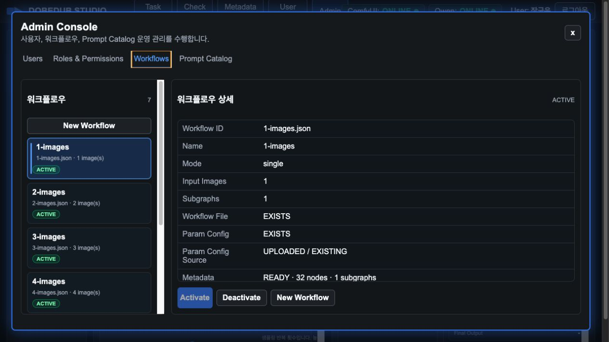

워크플로우 목록에서 항목을 선택하면 오른쪽 상세 정보가 표시됩니다.

상세 정보:

- Workflow ID
- Name
- Mode
- Input Images
- Subgraphs
- Workflow File
- Param Config
- Param Config Source
- Metadata
- Segment Defaults
- Description
- Registered At / Updated At

신규 workflow 등록 흐름:

1. `New Workflow` 클릭
2. Workflow JSON 파일 불러오기
3. 필요 시 Param Config JSON 불러오기
4. Param Config가 없으면 저장 시 자동 생성
5. Segment Defaults 자동 생성/갱신
6. Metadata 자동 갱신
7. 저장 후 필요 시 Activate

활성화된 workflow만 메인 `Workflow List`에 표시됩니다.

## 22. Prompt Catalog 관리

`Prompt Catalog` 탭에서는 Prompt Builder에서 사용하는 카테고리, 서브 카테고리, key word를 관리합니다.

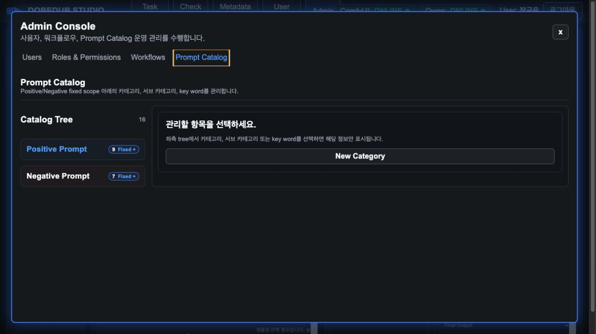

Prompt Catalog 구조:

- Fixed Scope
  - Positive Prompt
  - Negative Prompt
- Category
  - 작품/스타일
  - 인물/대상
  - 외형/속성
  - 동작/움직임
  - 표정/감정
  - 장면/배경
  - 카메라/구도
  - 조명/색감
  - 품질/렌더링
- Sub Category
  - 장르
  - 콘텐츠 등급
  - 애니메이션 스타일
  - 장면 전환 등
- Key Word
  - cinematic
  - documentary
  - preserve identity 등

관리 원칙:

- Positive/Negative Prompt 자체는 fixed scope이므로 편집 대상이 아닙니다.
- Category, Sub Category, Key Word는 조회/추가/수정/삭제 대상입니다.
- 삭제는 실제 제거가 아니라 비활성화 방식으로 운영하는 것을 권장합니다.
- Prompt Builder와 동일한 아코디언 트리 구조로 관리합니다.

선택 동작:

- Category 선택 시 category 정보가 표시됩니다.
- Sub Category 선택 시 상위 category 정보도 함께 표시됩니다.
- Key Word 선택 시 상위 sub category와 category 정보가 함께 표시됩니다.

사용자 입력 필드만 표시하고, 내부 기술 필드나 상속 기본값은 화면에 노출하지 않습니다.

## 23. Sandbox Pod 관리

`Sandbox Pod` 탭은 일반적인 영상 생성 작업을 위한 화면이 아닙니다. 영상 생성은 기존 RunPod Serverless ComfyUI endpoint를 계속 사용하며, 이 탭은 테스트/샌드박스 전용 Pod의 HTTP 서비스 주소를 확인하기 위한 별도 운영 기능입니다.

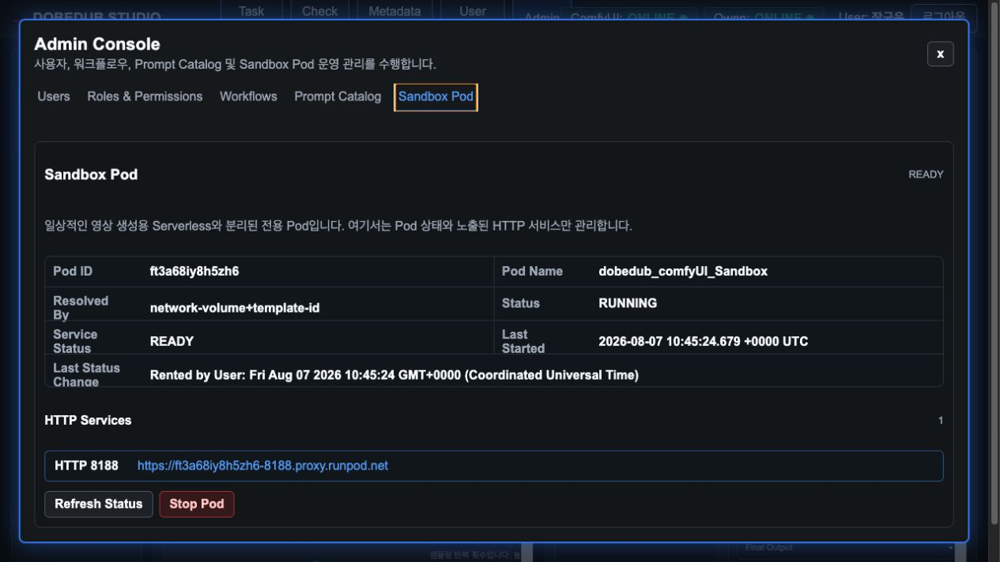

표시 정보:

- Pod ID와 현재 상태
- `Service Status`
  - `INITIALIZING`: Pod는 실행 중이지만 ComfyUI HTTP `8188`이 아직 준비되지 않은 상태
  - `READY`: Pod가 `RUNNING`이고 ComfyUI HTTP `8188` 응답까지 확인된 상태
- 마지막 시작/상태 변경 시각
- ComfyUI 전용 HTTP `8188` proxy URL

동작:

1. `Refresh Status`로 RunPod Pod 상태와 HTTP 노출 포트를 다시 조회합니다.
2. `Service Status`가 `INITIALIZING`이면 잠시 기다린 뒤 `Refresh Status`를 다시 누릅니다.
3. `READY`가 표시된 뒤 `HTTP 8188` URL을 열어 ComfyUI에 접속합니다. `8080`, `8888` 등 다른 내부 포트는 이 앱에서 제공하지 않습니다.
4. 사용이 끝나면 `Stop Pod`를 누르고 Studio 내부 확인 모달에서 `중지`를 선택합니다.
5. 중지된 Pod는 기존 호스트의 GPU 여유 부족으로 재개에 실패할 수 있습니다. 이때 표시되는 `Deploy Sandbox Pod`를 누르고 확인 모달에서 `배포`를 선택하면 Template, Network Volume, GPU 설정을 기준으로 새 Pod를 요청합니다.
6. 새 Pod 배포 뒤에는 `INITIALIZING` 상태가 표시될 수 있습니다. ComfyUI가 준비될 때까지 `Refresh Status`로 확인하고, `READY`가 된 뒤 접속합니다.

주의사항:

- `RUNPOD_SANDBOX_NETWORK_VOLUME_ID`, `RUNPOD_SANDBOX_POD_API_KEY`는 기존 `RUNPOD_ENDPOINT_ID`, `RUNPOD_API_KEY`와 분리해 관리합니다.
- RunPod migration은 새 Pod ID, proxy URL, Pod 이름을 만들거나 변경할 수 있습니다. 따라서 ID/이름이 아닌 전용 Network Volume ID를 기본 selector로 사용하고, 앱이 매 요청마다 현재 Pod를 찾아 사용합니다.
- Pod를 Template로 배포했다면 `RUNPOD_SANDBOX_TEMPLATE_ID`를 함께 설정해 selector를 더 엄격하게 만듭니다.
- 새 Pod 배포에는 `RUNPOD_SANDBOX_GPU_TYPE_ID`, `RUNPOD_SANDBOX_GPU_COUNT`, `RUNPOD_SANDBOX_DEPLOY_NAME`도 필요합니다. 현재 Sandbox 기준 GPU는 `NVIDIA GeForce RTX 5090`, 수량은 `1`입니다.
- selector에 여러 Pod가 일치하면 앱은 임의로 선택하지 않고 제어를 중단합니다. Sandbox 용도로는 하나의 Network Volume을 하나의 Pod에만 연결하세요.
- API 키는 화면이나 응답에 표시되지 않습니다.
- Pod template에서 ComfyUI `8188/http` 포트를 노출하지 않으면 접속 URL과 `READY` 상태가 표시되지 않습니다.

## 24. User Manual 사용법

`User Manual` 버튼을 누르면 이 매뉴얼이 앱 내부 모달로 열립니다.

매뉴얼 상단에는 검색창이 있습니다.

검색 사용:

1. 검색어를 입력합니다.
2. `검색` 버튼 또는 Enter를 누릅니다.
3. 검색 결과 위치로 자동 이동합니다.
4. `다음` 버튼으로 다음 결과로 이동합니다.

매뉴얼은 Markdown 원본을 기준으로 렌더링됩니다. 화면이나 기능이 변경되면 다음 항목을 함께 업데이트해야 합니다.

- 수정 이력
- 목차
- 관련 섹션 설명
- 화면 캡처 이미지
- 문제 해결 항목

## 25. 운영 시 주의사항

### 25.1 작업 실행 전 확인

- ComfyUI 상태가 ONLINE인지 확인합니다.
- Qwen 프롬프트 생성을 사용할 경우 Qwen 상태가 ONLINE인지 확인합니다.
- workflow 입력 이미지 수가 모두 채워졌는지 확인합니다.
- 현재 선택 subgraph가 의도한 subgraph인지 확인합니다.
- Negative Prompt 기본값이 유지되는지 확인합니다.

### 25.2 workflow 변경 시

workflow를 바꾸면 다음 값이 초기화됩니다.

- 이전 결과 영상
- subgraph output
- progress
- 입력 이미지 박스 구조
- Wan Node Config 기본값
- Payload Preview

### 25.3 Prompt Review 운영

좋은 결과를 만든 prompt는 반드시 Task History에서 리뷰합니다.

추천 흐름:

1. 결과 영상을 확인합니다.
2. Prompt Review 탭으로 이동합니다.
3. 품질 등급을 선택합니다.
4. 코멘트를 작성합니다.
5. 재사용 가능 여부를 결정합니다.
6. 재사용 가능이면 사유를 하나 이상 체크합니다.
7. 저장합니다.

이 과정을 거친 prompt만 Prompt Reuse에서 안정적으로 재활용할 수 있습니다.

### 25.4 관리자 변경 시

Admin Console에서 변경한 내용은 운영 기능에 직접 영향을 줍니다.

- 사용자 State를 INACTIVE로 바꾸면 해당 사용자는 로그인할 수 없습니다.
- Role Permission 변경은 해당 Role 사용자 전체에 영향을 줍니다.
- workflow를 비활성화하면 메인 Workflow List에서 사라집니다.
- Prompt Catalog 변경은 Prompt Builder key word 목록에 반영됩니다.
- Sandbox Pod 권한을 부여한 역할은 전용 Pod의 상태 조회 또는 시작/중지를 수행할 수 있습니다.

## 26. 문제 해결

| 증상 | 확인 항목 | 조치 |
| --- | --- | --- |
| 로그인 실패 | ID/Password, 사용자 State | Admin에서 사용자 ACTIVE 여부 확인 |
| Admin 메뉴가 보이지 않음 | 사용자 role/permission | `admin:*` 또는 필요한 admin permission 확인 |
| Prompt Builder가 비어 있음 | Prompt Catalog 데이터 | Admin > Prompt Catalog에서 카테고리/key word 확인 |
| Prompt Catalog가 Admin에서 비어 보임 | catalog 자동 로드 | Prompt Catalog 탭 진입 시 자동 로드됨. 새로고침 후 재확인 |
| Qwen 프롬프트 생성 실패 | Qwen 상태, endpoint ID, API key | Check Status에서 Qwen 항목 확인 |
| 영상 생성 실패 | ComfyUI 상태, RunPod log | Check Status와 Log Stream 확인 |
| 생성 결과 영상이 안 보임 | output asset 저장 여부 | Task History > Output Video와 Generation Info 확인 |
| Download MP4 실패 | asset path/storage | output file 존재 여부와 storage backend 확인 |
| workflow가 목록에 없음 | workflow active 여부 | Admin > Workflows에서 활성화 확인 |
| 새 workflow 기본값이 없음 | param config / segment defaults | workflow 저장 시 자동 생성 여부 확인 |
| Sandbox Pod 메뉴가 보이지 않음 | `sandbox:read` 권한 | Roles & Permissions 또는 Extra Permissions에 조회 권한 추가 |
| Sandbox Pod가 `INITIALIZING`에 머무름 | Pod 상태, ComfyUI 8188 기동 상태 | 잠시 기다린 뒤 Refresh Status를 누르고 RunPod Pod 로그 확인 |
| Sandbox HTTP URL이 없음 | Pod 상태, `8188/http` 포트 노출 | Pod template에서 `8188/http`를 노출하고 상태를 새로고침 |

매뉴얼 화면 자체가 비어 있거나 이미지가 나오지 않으면 `docs/dobedub-studio-user-manual.md`와 `docs/manual-assets` 파일이 배포 패키지에 포함되어 있는지 확인합니다.
