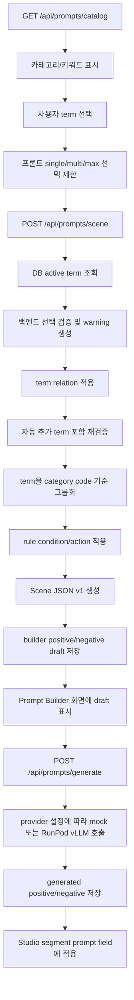

# DDL 및 프롬프트 키워드 선택/생성 로직 정리

이 문서는 v3 리팩터 기준 Prompt Builder에 필요한 DB DDL, 키워드 선택 규칙, Scene JSON 생성, positive/negative 프롬프트 생성 로직만 정리한다.

관련 구현 파일:

- `backend/app/db/models.py`
- `backend/app/db/migrations/versions/20260802_0002_prompt_builder_schema.py`
- `backend/app/db/migrations/versions/20260803_0003_prompt_catalog_v1_schema.py`
- `backend/app/services/prompt_builder_service.py`
- `schemas/scene-json-v1.schema.json`

## 1. DDL

### 1.1 prompt_categories

프롬프트 키워드 분류 사전이다. 화면의 카테고리 목록, 선택 방식, 적용 범위, 필수 여부를 관리한다.

```sql
CREATE TABLE prompt_categories (
  id INTEGER PRIMARY KEY AUTO_INCREMENT,
  code VARCHAR(64) NOT NULL UNIQUE,
  group_code VARCHAR(64) NOT NULL,
  parent_category_id INTEGER NULL,
  scope_type VARCHAR(32) NOT NULL DEFAULT 'SCENE',
  selection_type VARCHAR(32) NOT NULL DEFAULT 'MULTIPLE',
  required_yn BOOLEAN NOT NULL DEFAULT FALSE,
  max_select_count INTEGER NULL,
  name_ko VARCHAR(191) NOT NULL,
  name_en VARCHAR(191) NOT NULL,
  description TEXT NULL,
  sort_order INTEGER NOT NULL DEFAULT 100,
  is_active BOOLEAN NOT NULL DEFAULT TRUE,
  created_at DATETIME NOT NULL,
  updated_at DATETIME NOT NULL
);

CREATE INDEX ix_prompt_categories_group_code
  ON prompt_categories (group_code);
```

주요 값:

- `scope_type`: `GLOBAL`, `SCENE`, `ENTITY`, `OUTPUT`
- `selection_type`: `SINGLE`, `MULTIPLE`
- `required_yn`: Scene JSON 생성 시 필수 선택 여부
- `max_select_count`: multi 선택 시 최대 선택 개수

현재 예시 catalog 핵심 카테고리:

| code | group | scope | selection | max |
|---|---|---|---|---|
| `GENRE` | content | GLOBAL | MULTIPLE | 3 |
| `CONTENT_RATING` | content | GLOBAL | SINGLE | 1 |
| `SUBJECT_TYPE` | subject | SCENE | SINGLE | 1 |
| `CHARACTER_APPEARANCE` | subject | ENTITY | MULTIPLE | 5 |
| `CHARACTER_ACTION` | motion | ENTITY | MULTIPLE | 6 |
| `CAMERA_MOVEMENT` | camera | SCENE | MULTIPLE | 3 |
| `CAMERA_FRAMING` | camera | SCENE | SINGLE | 1 |
| `BACKGROUND` | environment | SCENE | MULTIPLE | 4 |
| `TIME_OF_DAY` | environment | SCENE | SINGLE | 1 |
| `WEATHER` | environment | SCENE | MULTIPLE | 2 |
| `LIGHTING` | style | SCENE | MULTIPLE | 3 |
| `COLOR_PALETTE` | style | SCENE | MULTIPLE | 3 |
| `VIDEO_MOOD` | style | SCENE | MULTIPLE | 3 |
| `QUALITY_TAG` | quality | OUTPUT | MULTIPLE | 4 |
| `NEGATIVE_ANATOMY` | negative | OUTPUT | MULTIPLE | 5 |
| `NEGATIVE_ARTIFACT` | negative | OUTPUT | MULTIPLE | 5 |
| `NEGATIVE_TEMPORAL` | negative | OUTPUT | MULTIPLE | 5 |

### 1.2 prompt_terms

사용자가 선택하는 실제 키워드 사전이다. 각 term은 기본 카테고리를 직접 가진다.

```sql
CREATE TABLE prompt_terms (
  id INTEGER PRIMARY KEY AUTO_INCREMENT,
  category_id INTEGER NOT NULL,
  code VARCHAR(128) NOT NULL UNIQUE,
  canonical_key VARCHAR(191) NULL,
  label_ko VARCHAR(191) NOT NULL,
  label_en VARCHAR(191) NOT NULL,
  description TEXT NULL,
  prompt_text TEXT NOT NULL,
  negative_text TEXT NULL,
  risk_level VARCHAR(32) NOT NULL DEFAULT 'NONE',
  metadata_json JSON NOT NULL,
  sort_order INTEGER NOT NULL DEFAULT 100,
  is_active BOOLEAN NOT NULL DEFAULT TRUE,
  created_at DATETIME NOT NULL,
  updated_at DATETIME NOT NULL,
  CONSTRAINT fk_prompt_terms_category_id_prompt_categories
    FOREIGN KEY (category_id) REFERENCES prompt_categories(id)
    ON DELETE CASCADE
);

CREATE UNIQUE INDEX uq_prompt_terms_code
  ON prompt_terms (code);

CREATE INDEX ix_prompt_terms_category_order
  ON prompt_terms (category_id, sort_order);

CREATE INDEX ix_prompt_terms_canonical_key
  ON prompt_terms (canonical_key);
```

주요 값:

- `label_ko`: UI 표시명
- `label_en`: Scene JSON에 들어가는 정규화 값
- `prompt_text`: positive prompt draft에 반영되는 문구
- `negative_text`: negative prompt draft에 반영되는 문구
- `canonical_key`: 장기적으로 모델/언어/카테고리 변경과 무관하게 term을 추적하기 위한 안정 키
- `risk_level`: `NONE`, `MEDIUM`, `HIGH`

### 1.3 prompt_category_terms

term 재사용을 위한 중간 테이블이다. 현재는 term의 기본 `category_id`도 유지하면서, 운영형 확장 시 하나의 term을 여러 카테고리에 연결할 수 있도록 둔다.

```sql
CREATE TABLE prompt_category_terms (
  category_id INTEGER NOT NULL,
  term_id INTEGER NOT NULL,
  default_polarity VARCHAR(32) NOT NULL,
  sort_order INTEGER NOT NULL,
  active_yn BOOLEAN NOT NULL,
  PRIMARY KEY (category_id, term_id),
  CONSTRAINT fk_prompt_category_terms_category_id_prompt_categories
    FOREIGN KEY (category_id) REFERENCES prompt_categories(id)
    ON DELETE CASCADE,
  CONSTRAINT fk_prompt_category_terms_term_id_prompt_terms
    FOREIGN KEY (term_id) REFERENCES prompt_terms(id)
    ON DELETE CASCADE
);

CREATE INDEX ix_prompt_category_terms_category_order
  ON prompt_category_terms (category_id, sort_order);
```

### 1.4 prompt_term_relations

키워드 간 관계/규칙을 저장한다. 예: 특정 term 선택 시 다른 term 추천, 충돌, 대체, 암시 관계.

```sql
CREATE TABLE prompt_term_relations (
  id INTEGER PRIMARY KEY AUTO_INCREMENT,
  source_term_id INTEGER NOT NULL,
  target_term_id INTEGER NOT NULL,
  relation_type VARCHAR(64) NOT NULL,
  weight FLOAT NOT NULL DEFAULT 1.0,
  metadata_json JSON NOT NULL,
  created_at DATETIME NOT NULL,
  CONSTRAINT fk_prompt_term_relations_source_term_id_prompt_terms
    FOREIGN KEY (source_term_id) REFERENCES prompt_terms(id)
    ON DELETE CASCADE,
  CONSTRAINT fk_prompt_term_relations_target_term_id_prompt_terms
    FOREIGN KEY (target_term_id) REFERENCES prompt_terms(id)
    ON DELETE CASCADE
);

CREATE INDEX ix_prompt_term_relations_source_type
  ON prompt_term_relations (source_term_id, relation_type);
```

### 1.5 prompt_rules

전역 프롬프트 규칙이다. 현재는 `i2v_mode`, `preserve_identity`, `avoid_new_objects` 같은 constraint 기반 append 규칙을 처리한다.

```sql
CREATE TABLE prompt_rules (
  id INTEGER PRIMARY KEY AUTO_INCREMENT,
  code VARCHAR(128) NOT NULL UNIQUE,
  name VARCHAR(191) NOT NULL,
  rule_type VARCHAR(64) NOT NULL DEFAULT 'constraint',
  condition_json JSON NOT NULL,
  action_json JSON NOT NULL,
  severity VARCHAR(32) NOT NULL DEFAULT 'info',
  is_active BOOLEAN NOT NULL DEFAULT TRUE,
  created_at DATETIME NOT NULL,
  updated_at DATETIME NOT NULL
);
```

현재 예시 catalog 규칙:

| code | condition | action |
|---|---|---|
| `i2v_preserve_identity` | `{"i2v_mode": true}` | positive에 `preserve identity from the input image`, negative에 `identity drift` 추가 |
| `avoid_unrequested_objects` | `{"avoid_new_objects": true}` | negative에 `new objects, unrelated background changes` 추가 |

### 1.6 prompt_templates

positive/negative prompt 기본 템플릿이다. 현재 mock/draft 단계에서는 직접 문자열 결합이 중심이고, 템플릿은 후속 LLM 출력 포맷 기준으로 보관한다.

```sql
CREATE TABLE prompt_templates (
  id INTEGER PRIMARY KEY AUTO_INCREMENT,
  code VARCHAR(128) NOT NULL UNIQUE,
  name VARCHAR(191) NOT NULL,
  prompt_type VARCHAR(32) NOT NULL,
  template_text TEXT NOT NULL,
  schema_json JSON NOT NULL,
  is_active BOOLEAN NOT NULL DEFAULT TRUE,
  created_at DATETIME NOT NULL,
  updated_at DATETIME NOT NULL
);

CREATE INDEX ix_prompt_templates_prompt_type
  ON prompt_templates (prompt_type);
```

### 1.7 model_profiles

모델 계열별 프롬프트 생성 특성을 저장한다.

```sql
CREATE TABLE model_profiles (
  id INTEGER PRIMARY KEY AUTO_INCREMENT,
  model_family VARCHAR(64) NOT NULL,
  model_name VARCHAR(191) NOT NULL,
  model_version VARCHAR(64) NULL,
  task_type VARCHAR(64) NOT NULL,
  prompt_language VARCHAR(16) NOT NULL,
  supports_negative_prompt BOOLEAN NOT NULL,
  supports_prompt_weight BOOLEAN NOT NULL,
  capabilities_json JSON NOT NULL,
  default_parameters_json JSON NOT NULL,
  active_yn BOOLEAN NOT NULL,
  created_at DATETIME NOT NULL
);

CREATE INDEX ix_model_profiles_model_family
  ON model_profiles (model_family);
```

현재 예시 catalog:

```json
{
  "modelFamily": "WAN",
  "modelName": "Wan Image-to-Video",
  "modelVersion": "2.1/2.2",
  "taskType": "image_to_video",
  "promptLanguage": "en",
  "supportsNegativePrompt": true,
  "supportsPromptWeight": false,
  "capabilities": {
    "sceneJsonVersion": "1.0",
    "supportsMultiImage": true
  }
}
```

### 1.8 prompt_term_renderings

term을 특정 모델/언어/positive-negative 문맥에 맞춰 어떻게 렌더링할지 저장한다.

```sql
CREATE TABLE prompt_term_renderings (
  id INTEGER PRIMARY KEY AUTO_INCREMENT,
  term_id INTEGER NOT NULL,
  model_profile_id INTEGER NULL,
  language_code VARCHAR(16) NOT NULL,
  polarity VARCHAR(32) NOT NULL,
  render_text TEXT NOT NULL,
  render_version VARCHAR(32) NOT NULL,
  active_yn BOOLEAN NOT NULL,
  CONSTRAINT fk_prompt_term_renderings_term_id_prompt_terms
    FOREIGN KEY (term_id) REFERENCES prompt_terms(id)
    ON DELETE CASCADE,
  CONSTRAINT fk_prompt_term_renderings_model_profile_id_model_profiles
    FOREIGN KEY (model_profile_id) REFERENCES model_profiles(id)
    ON DELETE CASCADE
);

CREATE INDEX ix_prompt_term_renderings_lookup
  ON prompt_term_renderings (term_id, model_profile_id, polarity);
```

### 1.9 prompt_generation_requests

Scene JSON 생성 또는 프롬프트 생성 요청 이력이다.

```sql
CREATE TABLE prompt_generation_requests (
  id VARCHAR(64) PRIMARY KEY,
  workflow_id VARCHAR(191) NULL,
  segment_index INTEGER NULL,
  language VARCHAR(16) NOT NULL DEFAULT 'ko',
  scene_json JSON NOT NULL,
  constraints_json JSON NOT NULL,
  selected_term_ids JSON NOT NULL,
  status VARCHAR(64) NOT NULL DEFAULT 'draft',
  created_by VARCHAR(191) NULL,
  created_at DATETIME NOT NULL
);

CREATE INDEX ix_prompt_generation_requests_workflow_segment
  ON prompt_generation_requests (workflow_id, segment_index);
```

### 1.10 prompt_generation_outputs

생성된 positive/negative prompt 결과 이력이다.

```sql
CREATE TABLE prompt_generation_outputs (
  id VARCHAR(64) PRIMARY KEY,
  request_id VARCHAR(64) NOT NULL,
  provider VARCHAR(64) NOT NULL DEFAULT 'builder',
  positive_prompt TEXT NOT NULL,
  negative_prompt TEXT NOT NULL,
  used_term_ids JSON NOT NULL,
  added_term_ids JSON NOT NULL,
  warnings_json JSON NOT NULL,
  raw_json JSON NOT NULL,
  created_at DATETIME NOT NULL,
  CONSTRAINT fk_prompt_generation_outputs_request_id_prompt_generation_requests
    FOREIGN KEY (request_id) REFERENCES prompt_generation_requests(id)
    ON DELETE CASCADE
);
```

### 1.11 prompt_feedback

생성 결과에 대한 사용자의 수정/평가 이력이다.

```sql
CREATE TABLE prompt_feedback (
  id VARCHAR(64) PRIMARY KEY,
  output_id VARCHAR(64) NOT NULL,
  task_id VARCHAR(64) NULL,
  rating INTEGER NULL,
  edited_positive_prompt TEXT NULL,
  edited_negative_prompt TEXT NULL,
  notes TEXT NULL,
  created_by VARCHAR(191) NULL,
  created_at DATETIME NOT NULL,
  CONSTRAINT fk_prompt_feedback_output_id_prompt_generation_outputs
    FOREIGN KEY (output_id) REFERENCES prompt_generation_outputs(id)
    ON DELETE CASCADE
);
```

## 2. 키워드 선택 로직

### 2.1 카탈로그 조회

API:

```http
GET /api/prompts/catalog
```

반환 구조:

```json
{
  "categories": [
    {
      "id": 1,
      "code": "GENRE",
      "groupCode": "content",
      "scopeType": "GLOBAL",
      "selectionMode": "multi",
      "required": false,
      "maxSelectCount": 3,
      "terms": []
    }
  ],
  "rules": [],
  "templates": []
}
```

프론트는 `selectionMode`, `required`, `maxSelectCount`를 보고 선택 UI를 제어한다.

### 2.2 프론트 선택 규칙

구현 위치:

- `frontend/src/main.tsx`
- `togglePromptTerm(termId)`

규칙:

1. 이미 선택된 term을 다시 클릭하면 선택 해제한다.
2. 카테고리가 `single`이면 같은 카테고리의 기존 선택 term을 제거하고 새 term만 선택한다.
3. 카테고리가 `multi`이고 `maxSelectCount`가 있으면 최대 개수를 초과하지 못하게 막는다.
4. 선택값이 변경되면 기존 Scene JSON과 생성 prompt 결과는 초기화한다.

### 2.3 백엔드 선택 검증

구현 위치:

- `backend/app/services/prompt_builder_service.py`
- `_validate_and_normalize_terms(session, terms)`

백엔드에서도 동일하게 선택값을 검증한다. 프론트 제어만 믿지 않고 API 직접 호출에도 안전하게 동작하게 하기 위함이다.

검증 규칙:

1. 선택된 `termIds`를 DB의 active term으로 조회한다.
2. category code 기준으로 term을 그룹화한다.
3. category가 `SINGLE`이면 1개만 유지하고 나머지는 무시한다.
4. category가 `MULTIPLE`이고 `max_select_count`가 있으면 해당 개수까지만 유지한다.
5. 잘린 term이 있으면 `selection_limit_trimmed` warning을 반환한다.
6. `required_yn=true`인 category가 선택되지 않았으면 `required_category_missing` warning을 반환한다.

warning 예:

```json
{
  "code": "selection_limit_trimmed",
  "message": "SUBJECT_TYPE accepts up to 1 term(s); extra terms were ignored.",
  "severity": "warning"
}
```

### 2.4 term relation 처리

구현 위치:

- `backend/app/services/prompt_builder_service.py`
- `_apply_term_relations(session, terms)`

`prompt_term_relations`는 키워드 간 추천/충돌/암시 관계를 처리한다. 현재 1차 구현 범위는 `IMPLY`, `RECOMMEND`, `EXCLUDE`이다.

현재 예시 catalog relation:

| source | relation | target | 동작 |
|---|---|---|---|
| `subject_person` | `IMPLY` | `appearance_preserve_identity` | 인물 대상 선택 시 동일성 유지 term을 자동 추가 |
| `camera_static` | `EXCLUDE` | `camera_slow_tracking` | 두 카메라 움직임이 동시에 선택되면 충돌 warning |
| `action_gentle_walk` | `RECOMMEND` | `quality_stable_motion` | 천천히 걷기 선택 시 안정적 움직임 품질 term 추천 warning |

처리 순서:

1. term 선택값에 대해 single/multi/max/required 검증을 먼저 수행한다.
2. 검증 후 남은 term을 기준으로 relation을 조회한다.
3. `IMPLY`: target term이 선택되어 있지 않으면 자동 추가하고 `term_implied` info warning을 남긴다.
4. `RECOMMEND`: target term이 선택되어 있지 않으면 자동 추가하지 않고 `term_recommended` info warning만 남긴다.
5. `EXCLUDE`: source와 target이 함께 선택되어 있으면 제거하지 않고 `term_relation_conflict` warning을 남긴다.
6. relation 처리 후 자동 추가 term을 포함해 single/multi/max/required 검증을 다시 수행한다.

warning 예:

```json
{
  "code": "term_implied",
  "message": "Person subjects imply identity preservation for image-to-video generation.",
  "severity": "info",
  "sourceTermId": 4,
  "targetTermId": 6,
  "relationType": "IMPLY"
}
```

설계상 `RECOMMEND`와 `EXCLUDE`는 사용자가 선택을 조정할 수 있도록 warning만 반환한다. 자동 제거는 하지 않는다.

## 3. Scene JSON 생성 로직

### 3.1 요청

API:

```http
POST /api/prompts/scene
```

요청 예:

```json
{
  "workflowId": "1-images.json",
  "segmentIndex": 1,
  "language": "ko",
  "termIds": [1, 4, 7, 19],
  "constraints": {
    "preserve_identity": true,
    "avoid_new_objects": true,
    "i2v_mode": true
  }
}
```

기본 constraints:

```json
{
  "preserve_identity": true,
  "avoid_new_objects": true,
  "i2v_mode": true
}
```

요청에서 `constraints`가 들어오면 기본값 위에 병합된다.

### 3.2 term 그룹화

검증 후 남은 term은 category code를 소문자로 바꾼 key에 모인다.

예:

```json
{
  "genre": ["cinematic"],
  "subject_type": ["person"],
  "character_action": ["gentle walking"],
  "camera_movement": ["slow tracking"],
  "negative_anatomy": ["avoid distortion"]
}
```

동시에:

- `prompt_text`가 있으면 positive draft 후보에 추가한다.
- `negative_text`가 있으면 negative draft 후보에 추가한다.

### 3.3 rule 적용

active rule을 조회한 뒤 `condition_json`이 constraints와 모두 일치하면 `action_json`을 적용한다.

현재 rule 적용 방식:

```python
positive_parts.extend(action["positive_append"])
negative_parts.extend(action["negative_append"])
```

예:

```json
{
  "condition": {
    "i2v_mode": true
  },
  "action": {
    "positive_append": ["preserve identity from the input image"],
    "negative_append": ["identity drift"]
  }
}
```

### 3.4 Scene JSON v1 구조

구현 위치:

- `_build_scene_v1(payload, grouped, constraints)`
- 표준 schema artifact: `schemas/scene-json-v1.schema.json`
- schema 조회 API: `GET /api/prompts/scene-schema`
- runtime 검증: `jsonschema.Draft202012Validator` 기반 `validate_scene_json_v1_with_schema()`

생성 구조:

```json
{
  "version": "1.0",
  "workflowId": "1-images.json",
  "segmentIndex": 1,
  "language": "ko",
  "genres": ["cinematic"],
  "contentRating": ["brand-safe"],
  "scenes": [
    {
      "sequenceNo": 1,
      "summary": "",
      "entities": [
        {
          "id": "entity_1",
          "type": "person",
          "name": "person",
          "importance": "PRIMARY",
          "referenceAssetId": null,
          "attributes": ["preserve identity"],
          "actions": ["gentle walking"]
        }
      ],
      "relations": [],
      "camera": {
        "framing": ["medium shot"],
        "movement": ["slow tracking"],
        "angle": [],
        "lens": [],
        "focus": []
      },
      "environment": {
        "background": ["preserve original background"],
        "location": [],
        "timeOfDay": ["preserve original time of day"],
        "weather": ["preserve original weather"]
      },
      "style": {
        "lighting": ["soft light"],
        "colorPalette": ["balanced color"],
        "mood": ["calm"],
        "animationStyle": [],
        "renderingStyle": []
      },
      "motion": {
        "speed": [],
        "intensity": []
      },
      "quality": ["stable motion"],
      "negativeTerms": ["avoid distortion"]
    }
  ],
  "constraints": {
    "preserve_identity": true,
    "avoid_new_objects": true,
    "i2v_mode": true
  }
}
```

`POST /api/prompts/scene` payload에 `entities`와 `relations`가 없으면 단일 primary entity fallback을 생성한다.
payload에 `entities`가 있으면 entity별 `actions`를 유지하여 복수 주체의 동작을 구분한다.
payload에 `relations`가 있으면 `subjectEntityId`, `predicate`, `objectEntityId/freeObjectText`, `sequenceNo`를 Scene JSON v1 relation으로 정규화한다.
Prompt Builder UI의 `Scene Entities` 섹션에서 복수 entity/action/relation을 직접 편집할 수 있다.

## 4. Positive/Negative Draft 생성 로직

### 4.1 builder draft

`POST /api/prompts/scene`은 Scene JSON과 함께 deterministic draft를 생성한다.

모델 프로필 선택:

1. 요청 payload에 `modelProfileId`가 있고 active profile이면 해당 profile을 사용한다.
2. 없으면 `modelFamily`, `modelName` 조건으로 active profile을 찾는다.
3. 조건이 없으면 active `WAN` profile을 기본으로 사용한다.
4. 그래도 없으면 term의 기본 `prompt_text`, `negative_text`를 사용한다.

term 문구 선택:

1. active model profile이 있으면 `prompt_term_renderings`에서 `term_id`, `model_profile_id`, `language_code`, `polarity`가 일치하는 row를 먼저 찾는다.
2. positive는 `polarity='POSITIVE'`를 사용한다.
3. negative는 `polarity='NEGATIVE'`를 사용한다.
4. rendering row가 없으면 `prompt_terms.prompt_text` 또는 `prompt_terms.negative_text`로 fallback한다.

positive draft 구성:

1. 선택 term의 model-specific positive rendering 또는 `prompt_text`
2. 적용 rule의 `positive_append`
3. 중복 제거
4. `, `로 결합

negative draft 구성:

1. 선택 term의 model-specific negative rendering 또는 `negative_text`
2. 적용 rule의 `negative_append`
3. 중복 제거
4. `, `로 결합

중복 제거 기준:

- 공백 제거 후 비어 있지 않은 값만 사용
- 대소문자를 무시하고 이미 나온 문구는 제거

### 4.2 저장

Scene JSON 생성 시 다음 두 테이블에 저장한다.

`prompt_generation_requests`:

- `status='draft'`
- `scene_json`
- `constraints_json`
- `selected_term_ids`
- `workflow_id`
- `segment_index`

`prompt_generation_outputs`:

- `provider='builder'`
- `positive_prompt`
- `negative_prompt`
- `used_term_ids`
- `warnings_json`
- `raw_json`

응답 예:

```json
{
  "requestId": "prompt_req_20260803_120000_ab12cd",
  "outputId": "prompt_out_20260803_120000_ef34gh",
  "provider": "builder",
  "workflowId": "1-images.json",
  "segmentIndex": 1,
  "language": "ko",
  "scene": {},
  "constraints": {},
  "positivePromptDraft": "cinematic image-to-video shot, the person from the input image",
  "negativePromptDraft": "distorted anatomy, identity drift",
  "usedTermIds": [1, 4, 7],
  "warnings": []
}
```

## 5. Prompt Generation 로직

### 5.1 요청

API:

```http
POST /api/prompts/generate
```

지원 provider:

- `mock`: 로컬 deterministic 검증용 기본 provider
- `runpod_vllm`: RunPod Serverless native `/runsync` 호출
- `openai_compatible`: vLLM OpenAI-compatible `/chat/completions` 호출

요청 예:

```json
{
  "workflowId": "1-images.json",
  "segmentIndex": 1,
  "language": "ko",
  "provider": "mock",
  "termIds": [1, 4, 7],
  "scene": {
    "version": "1.0",
    "scenes": []
  },
  "constraints": {
    "preserve_identity": true,
    "avoid_new_objects": true
  }
}
```

### 5.2 Scene JSON 해석

구현 위치:

- `_mock_llm_prompt(scene, constraints)`

v1 Scene JSON 기준으로 다음 값을 읽는다.

| prompt 구성 요소 | Scene JSON 위치 |
|---|---|
| genre | `genres` |
| subject | `scenes[0].entities[0].type`, `name`, `attributes` |
| action | `scenes[0].entities[].actions` |
| camera movement | `scenes[0].camera.movement` |
| framing | `scenes[0].camera.framing` |
| style | `scenes[0].style.lighting`, `colorPalette`, `mood` |
| quality | `scenes[0].quality` |
| negative | `scenes[0].negativeTerms` + 기본 negative 문구 |

v0 호환을 위해 `genre`, `subject`, `action`, `camera.motion`, `camera.shotType`, `style.color`도 fallback으로 읽는다.

### 5.3 Mock positive prompt 생성

기본 구성 순서:

1. genre
2. subject
3. action
4. camera movement
5. framing
6. style
7. quality
8. `preserve_identity=true`이면 `preserve identity from the input image` 추가

값이 없을 때 fallback:

| 항목 | fallback |
|---|---|
| genre | `cinematic image-to-video shot` |
| subject | `the subject from the input image` |
| action | `subtle natural motion` |
| camera | `stable camera movement` |
| quality | `stable motion, coherent frames` |

### 5.4 Mock negative prompt 생성

기본 negative:

```text
distorted anatomy, warped body, deformed face, extra limbs, blur, flicker, watermark, subtitles, text artifacts
```

추가 규칙:

- `avoid_new_objects=true`이면 `new objects, unrelated background changes` 추가
- `preserve_identity=true`이면 `identity drift` 추가
- `scene.scenes[0].negativeTerms`가 있으면 추가

### 5.5 저장

`POST /api/prompts/generate`는 다음을 저장한다.

`prompt_generation_requests`:

- `status='generated'`
- 입력 scene/constraints/termIds 저장

`prompt_generation_outputs`:

- `provider='mock'`, `runpod_vllm`, `openai_compatible` 중 실제 사용 provider 저장
- 생성된 positive/negative 결과 저장
- warning 저장

warning 예:

```json
{
  "code": "missing_action",
  "message": "Action term is empty; mock provider used subtle motion fallback.",
  "severity": "warning"
}
```

## 6. 전체 흐름 요약



## 7. 현재 한계와 다음 확장 지점

현재 완료:

- Prompt Catalog v1 DDL
- 핵심 카테고리 예시 데이터
- single/multi/max/required 검증
- `prompt_term_relations` 기반 `IMPLY`, `RECOMMEND`, `EXCLUDE` 1차 처리
- Scene JSON v1 기본 구조
- 내부 schema validator 기반 Scene JSON v1 검증
- 표준 JSON Schema artifact 파일 분리 및 API 제공
- `jsonschema` 기반 표준 JSON Schema artifact runtime 검증
- builder draft 생성
- builder draft 생성 시 `prompt_term_renderings` 우선 적용
- Prompt Builder `Scene Structure` preview에서 scene/entity/relation 요약 표시
- `/api/prompts/scene`의 복수 entity/action/relation payload 반영
- Prompt Builder `Scene Entities` UI의 복수 entity/action/relation 직접 편집
- 확장 카테고리 예시 데이터 및 Scene JSON 매핑: object action, motion speed/intensity, camera angle/lens/focus, subject detail, animation/rendering/transition/duration, negative quality/camera/text
- Prompt Builder entity asset picker, relation predicate template, validation hint
- Prompt Catalog Admin 1차 UI/API: category/term 추가, 수정, 비활성화
- mock prompt generation

남은 확장:

- 복수 entity 편집 UX 고도화(asset preview thumbnail, relation template 관리 DB화)
- Prompt Catalog Admin 고도화: relation/rule/template 관리, 변경 이력, 권한 분리
- `prompt_term_relations` 기반 `REQUIRE`, `LIMIT`, `RATING_BLOCK`, `MODEL_BLOCK`, `REPLACE`, `ORDER` 처리 범위 정의
- 실제 LLM provider 호출 시 `prompt_term_renderings`와 model profile을 provider payload에 반영
- 실제 LLM provider 연동
- 확장 카테고리 예시 데이터 추가
