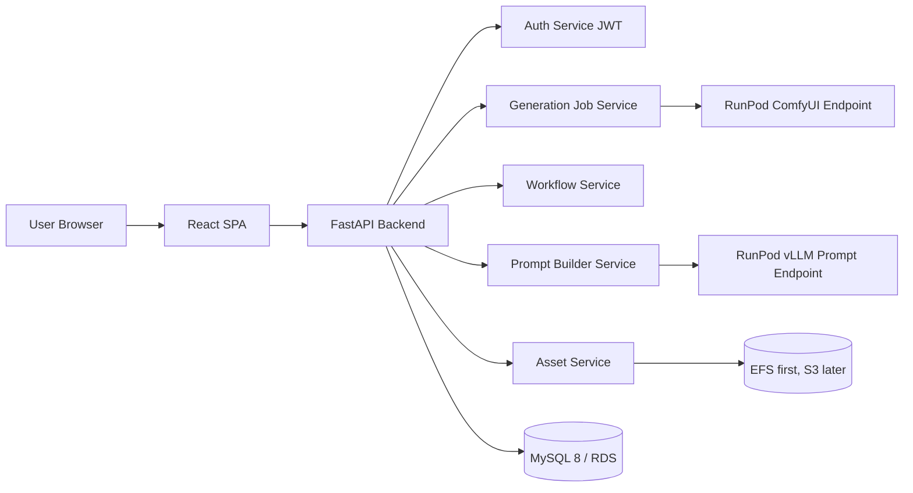
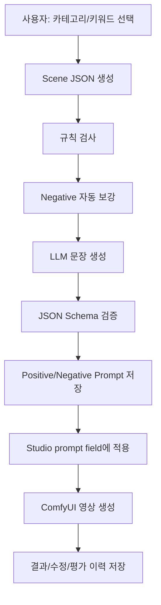

# DOBEDUB STUDIO 고도화 방안 설계

작성일: 2026-08-02  
대상: `comfyui-video-studio-app-v2`

## 1. 목적

현재 DOBEDUB STUDIO는 Python `http.server` 기반 단일 서버가 정적 UI, API, RunPod 연동, JSON 파일 저장을 모두 담당한다. 기능 검증과 빠른 운영에는 적합하지만, 사용자 증가, 작업 이력 검색, 워크플로우 버전 관리, 프롬프트 자산화, LLM 기반 프롬프트 생성 기능을 안정적으로 확장하기에는 한계가 있다.

고도화는 두 단계로 나눈다.

1. 프론트/백엔드 분리, FastAPI 백엔드, React 프론트, MySQL DB 도입
2. 프롬프트 카테고리/키워드 관리, 경량 LLM 기반 positive/negative 프롬프트 생성, 생성/수정/평가 이력 관리

## 2. 현재 구조 진단

현재 주요 구성은 다음과 같다.

| 영역 | 현재 상태 | 리팩터링 필요성 |
|---|---|---|
| 서버 | `server.py` 단일 파일, 약 2,300라인 | API, RunPod, 파일, 인증, 정적 서빙 책임 분리 필요 |
| 프론트 | `index.html`, `src/app.js`, `src/styles.css` | 상태/모달/라우팅이 한 파일에 집중, React 전환 필요 |
| 저장소 | `data/*.json`, EFS 운영 | 검색/동시성/정합성/마이그레이션 한계 |
| 워크플로우 | `workflows/*.json`, `*.paramconfig.json`, `data/segment-defaults.json` | 버전 관리, 활성화/검증/롤백 관리 필요 |
| 작업 실행 | RunPod Serverless `/run`, `/status`, `/cancel`, `/health` | 서비스 계층으로 분리 필요 |
| 에셋 | 로컬/EFS 파일 + `assets.json` | DB 메타데이터 + 스토리지 분리 필요 |
| 인증 | 자체 입력값 중심 | 사용자 테이블, 비밀번호 해시, 권한 관리 필요 |

## 3. 목표 아키텍처



원칙은 다음과 같다.

- 프론트와 백엔드는 REST/JSON API로만 통신한다.
- 백엔드는 FastAPI로 전환하되, 기존 RunPod workflow patch 로직은 서비스 함수로 재사용한다.
- 작업 이력, 사용자, 워크플로우, 설정, 프롬프트, LLM 호출 이력은 MySQL에 저장한다.
- 업로드 이미지, 결과 MP4, 리포트 파일은 DB에 넣지 않고 스토리지에 저장한다.
- 운영 1차는 현재 ECS/EFS 흐름을 유지하고, 이후 S3로 전환한다.
- 워크플로우는 active version을 불변 참조한다. 과거 작업 재현성이 가장 중요하다.

## 4. Phase 1: 구조 분리 및 MySQL 전환

### 4.1 백엔드 구조

권장 디렉토리:

```text
backend/
  app/
    main.py
    core/
      config.py
      security.py
      database.py
    api/
      v1/
        auth.py
        workflows.py
        jobs.py
        assets.py
        history.py
        reports.py
        metadata.py
        prompts.py
        admin.py
    models/
    schemas/
    services/
      workflow_parser.py
      workflow_patcher.py
      runpod_client.py
      asset_storage.py
      job_service.py
      prompt_builder.py
      llm_client.py
    repositories/
    migrations/
```

핵심 서비스 분리는 다음 기준으로 한다.

| 서비스 | 책임 |
|---|---|
| `workflow_parser` | Export API JSON, paramconfig, segment defaults 파싱 |
| `workflow_patcher` | 사용자 입력값을 workflow graph에 반영 |
| `runpod_client` | `/run`, `/status`, `/cancel`, `/health` 호출 |
| `job_service` | 작업 생성, 상태 동기화, 완료/실패/취소 처리 |
| `asset_storage` | 업로드/다운로드/결과 파일 저장, presigned URL 전환 대비 |
| `prompt_builder` | 카테고리 선택값을 scene JSON으로 구조화 |
| `llm_client` | 프롬프트 생성 전용 LLM endpoint 호출 |

### 4.2 React 프론트 구조

권장 디렉토리:

```text
frontend/
  src/
    app/
      router.tsx
      providers.tsx
    pages/
      LoginPage.tsx
      StudioPage.tsx
      HistoryPage.tsx
      MetadataPage.tsx
      ManualPage.tsx
      AdminWorkflowsPage.tsx
      PromptBuilderPage.tsx
    components/
      studio/
      history/
      workflow/
      prompt/
      common/
    api/
      client.ts
      jobs.ts
      workflows.ts
      prompts.ts
    stores/
      authStore.ts
      studioStore.ts
    types/
```

모달 중심 구조는 페이지/라우트로 분리한다.

| 현재 | 전환 |
|---|---|
| History/Saved Videos 모달 | `/history` 페이지 + 상세 패널 |
| Metadata 보기 모달 | `/metadata` 또는 `/admin/metadata` |
| User Manual 모달 | `/manual` |
| 프롬프트 선택 모달 | `/prompts/library` 또는 Studio 내 drawer |
| workflow list select | `/studio` 좌측 workflow panel 유지 |

### 4.3 MySQL 핵심 스키마

Phase 1 최소 스키마는 다음 묶음으로 시작한다.

```text
users
workflows
workflow_versions
workflow_segment_defaults
workflow_param_bindings
workflow_param_binding_targets
assets
jobs
job_segments
job_input_images
job_output_assets
job_events
reports
```

설계 포인트:

- `jobs.workflow_version_id`는 작업 실행 당시 active version을 고정 참조한다.
- `jobs.patched_graph_json`은 실제 RunPod에 제출한 최종 graph snapshot을 저장한다.
- `job_segments.config_json`은 노출된 Wan config 값을 저장한다.
- `assets.storage_key`는 EFS path 또는 S3 object key를 저장한다.
- `workflow_versions.status`는 `draft -> validated -> active -> archived` 상태 모델로 관리한다.
- 신규 workflow upload 시 기존 active binding을 title/class_type 기반으로 자동 이관하고, 실패 항목은 `needs_review=1`로 관리자 검토 대상화한다.

### 4.4 API 설계

```text
POST   /api/v1/auth/login
POST   /api/v1/auth/refresh
POST   /api/v1/auth/logout

GET    /api/v1/workflows
GET    /api/v1/workflows/{workflow_id}
GET    /api/v1/workflows/{workflow_id}/schema
GET    /api/v1/workflows/{workflow_id}/segment-defaults

POST   /api/v1/assets
GET    /api/v1/assets/{asset_uid}

POST   /api/v1/jobs
GET    /api/v1/jobs/{job_uid}
POST   /api/v1/jobs/{job_uid}/cancel
GET    /api/v1/history
DELETE /api/v1/history/{job_uid}

POST   /api/v1/admin/workflows
POST   /api/v1/admin/workflows/{workflow_id}/versions
POST   /api/v1/admin/workflow-versions/{version_id}/validate
POST   /api/v1/admin/workflow-versions/{version_id}/activate
```

## 5. Phase 2: 프롬프트 카테고리/키워드 및 경량 LLM

### 5.1 권장 전체 흐름



LLM은 모든 판단을 맡기지 않는다. 앱이 먼저 구조화와 규칙 검사를 수행하고, LLM은 문장화와 중복 제거에 집중한다.

### 5.2 카테고리 모델

카테고리별 테이블을 각각 만드는 것보다 통합 테이블을 권장한다.

```text
prompt_categories
prompt_terms
prompt_term_relations
prompt_rules
prompt_templates
prompt_generation_requests
prompt_generation_outputs
prompt_feedback
```

권장 카테고리:

| 그룹 | 코드 | 예 |
|---|---|---|
| 콘텐츠 | `GENRE` | cinematic, fantasy, documentary |
| 콘텐츠 | `CONTENT_RATING` | all ages, safe, brand-safe |
| 대상 | `SUBJECT_TYPE` | person, animal, product, object |
| 대상 | `CHARACTER_APPEARANCE` | outfit, hair, age range, expression |
| 동작 | `ACTION` | walking, turning, dancing |
| 카메라 | `CAMERA_MOTION` | dolly in, pan, tracking |
| 구도 | `SHOT_TYPE` | close-up, wide shot, eye-level |
| 조명 | `LIGHTING` | soft light, neon, backlight |
| 색감 | `COLOR_STYLE` | warm, pastel, high contrast |
| 분위기 | `MOOD` | calm, dramatic, playful |
| 품질 | `QUALITY_TAG` | detailed, stable motion |
| 제한 | `NEGATIVE_TAG` | blur, distortion, watermark |

### 5.3 Prompt Builder 입력/출력

입력은 사용자가 고른 단어 그대로 LLM에 던지지 않고 scene JSON으로 정규화한다.

```json
{
  "workflow_key": "1-images.json",
  "language": "ko",
  "scene": {
    "genre": ["cinematic"],
    "subject": {
      "type": "person",
      "appearance": ["same identity as input image"]
    },
    "action": ["gentle walking motion"],
    "camera": ["slow tracking shot"],
    "lighting": ["soft natural light"],
    "mood": ["calm"]
  },
  "constraints": {
    "preserve_identity": true,
    "avoid_new_objects": true,
    "i2v_mode": true
  }
}
```

LLM 출력은 반드시 JSON Schema로 제한한다.

```json
{
  "positive_prompt": "A concise English paragraph...",
  "negative_prompt": "blur, distortion, extra limbs...",
  "used_term_ids": [101, 203],
  "added_term_ids": [901],
  "warnings": []
}
```

### 5.4 LLM 구성

프롬프트 생성 전용 LLM은 ComfyUI RunPod endpoint와 분리한다.

| 항목 | 권장 |
|---|---|
| 배포 | RunPod Serverless 별도 endpoint |
| 추론 서버 | vLLM |
| 모델 | `Qwen/Qwen3-4B-Instruct-2507` 우선 검토 |
| GPU | 16GB급 A4000/A4500/RTX 4000 계열부터 검증 |
| API | OpenAI-compatible `/v1/chat/completions` 또는 내부 `/generate-prompt` |
| 출력 | JSON only |

분리 이유:

- ComfyUI 영상 생성과 LLM이 같은 GPU VRAM을 경쟁하지 않는다.
- ComfyUI 재시작/워크플로우 오류가 프롬프트 생성 기능까지 중단시키지 않는다.
- LLM endpoint는 짧은 요청 중심이라 별도 autoscale이 쉽다.
- 향후 VL 모델 도입 시 독립 확장 가능하다.

### 5.5 초기에는 파인튜닝하지 않는다

초기 품질은 다음 순서로 확보한다.

1. 카테고리/키워드 사전
2. 조합 규칙
3. 시스템 프롬프트
4. JSON Schema
5. 장르별 few-shot 예제
6. 사용자 수정 이력
7. 결과 평가

운영 데이터가 쌓인 뒤 다음 데이터를 학습셋 후보로 삼는다.

```text
scene_json
initial_llm_prompt
user_edited_prompt
final_generation_result
user_rating
```

## 6. 단계별 실행 계획

### Step 0. 동결 및 회귀 기준 수립

- 현재 v2를 `legacy-monolith` 기준으로 고정한다.
- 주요 동작을 smoke test로 문서화한다.
- RunPod 실제 실행, cancel, history view, rework, asset download, segment defaults, metadata view를 회귀 기준으로 둔다.

### Step 1. FastAPI 백엔드 skeleton

- 기존 `server.py` 라우트를 FastAPI endpoint로 1:1 이전한다.
- 저장소는 아직 JSON/EFS adapter를 유지한다.
- 프론트는 기존 vanilla JS가 새 FastAPI API를 호출하도록 임시 연결 가능하게 한다.

완료 기준:

- 기존 UI에서 모든 API 동작이 동일하다.
- `server.py` 핵심 로직이 `services/`로 분리된다.

### Step 2. MySQL 도입

- SQLAlchemy/Alembic 설정
- JSON 파일 마이그레이션 스크립트 작성
- repository layer를 JSON adapter에서 MySQL adapter로 교체
- EFS 파일은 유지하고 DB에는 asset metadata만 저장

완료 기준:

- 기존 history/assets/configs가 MySQL로 이관된다.
- 재작업과 결과 preview가 DB 기반으로 동작한다.
- ECS 재시작 후에도 작업 이력/에셋 메타데이터가 유지된다.

### Step 3. React 전환

- Vite + React + TypeScript scaffold
- `/login`, `/studio`, `/history`, `/metadata`, `/manual`, `/admin/*` 라우트 구성
- TanStack Query로 job polling, history pagination, workflow schema cache 처리
- 기존 CSS 토큰/시각 스타일을 단계적으로 이식

완료 기준:

- 기존 기능 parity 달성
- 모달 중심 기능이 페이지/패널로 분리된다.
- 모바일/데스크톱 주요 화면 깨짐 없음

### Step 4. 관리자 워크플로우/메타데이터 관리

- workflow upload
- workflow version parsing
- node/widget tree view
- param binding target 검토
- metadata snapshot upload
- active version 승격

완료 기준:

- 새 workflow JSON 업로드 후 draft version 생성
- 기존 binding 자동 이관
- 관리자 검토 후 active 전환
- 기존 작업은 과거 workflow version으로 재현 가능

### Step 5. 프롬프트 DB

- prompt category/term/rule/template 관리 화면
- Studio 화면에서 카테고리 기반 prompt builder 추가
- 기존 직접 입력 방식은 유지

완료 기준:

- 사용자가 category/term 선택으로 scene JSON을 만들 수 있다.
- positive/negative를 자동 생성 전 단계까지 구성할 수 있다.

### Step 6. LLM 프롬프트 생성

- RunPod vLLM endpoint 구성
- `/api/v1/prompts/generate` API 추가
- JSON Schema validation
- 생성 이력/사용자 수정 이력 저장
- prompt 적용 버튼으로 Studio prompt field에 주입

완료 기준:

- LLM이 positive/negative JSON을 반환한다.
- 실패/검증 오류 시 fallback 메시지와 재시도 가능
- 생성된 prompt, 수정 prompt, 사용된 term, warnings가 DB에 저장된다.

## 7. 주요 리스크와 대응

| 리스크 | 대응 |
|---|---|
| 한 번에 React/FastAPI/MySQL을 모두 바꾸면 회귀 범위가 큼 | JSON adapter 유지 상태로 FastAPI 먼저 이식 |
| workflow version/binding이 틀리면 RunPod 실행 실패 | draft/validated/active 상태 모델과 관리자 검토 |
| DB 이관 후 기존 이력 preview/download 깨짐 | asset storage key와 기존 EFS path 매핑 검증 |
| LLM이 입력에 없는 요소를 생성 | scene JSON, rule check, system prompt, JSON Schema, warnings |
| ComfyUI와 LLM GPU 경쟁 | 별도 RunPod endpoint |
| prompt quality가 불안정 | 초기에는 파인튜닝 금지, 규칙/템플릿/few-shot/이력 기반 개선 |
| S3 전환 시 URL/권한 문제 | storage adapter 인터페이스를 먼저 만들고 EFS/S3 구현 분리 |

## 8. 권장 우선순위

가장 안전한 순서는 다음이다.

1. `server.py` 서비스 분리
2. FastAPI skeleton + 기존 JSON adapter
3. MySQL schema/Alembic + migration
4. React shell + 기능 parity
5. 관리자 workflow version/metadata 관리
6. prompt category DB
7. LLM prompt endpoint
8. prompt feedback/analytics
9. S3 storage 전환

프롬프트 LLM 기능은 React/MySQL 전환 후 붙이는 것이 좋다. 생성 프롬프트와 사용자 수정 이력을 구조적으로 저장해야 나중에 품질 개선과 파인튜닝 판단이 가능하기 때문이다.

## 9. 1차 구현 산출물

다음 작업부터 착수한다.

- `backend/` FastAPI 프로젝트 scaffold
- `frontend/` React/Vite scaffold
- `docker-compose.dev.yml`에 backend, frontend, mysql 추가
- Alembic initial migration
- 기존 `data/*.json` → MySQL migration script
- 기존 `server.py`에서 RunPod/workflow/asset 로직 추출
- `/api/v1/health`, `/api/v1/workflows`, `/api/v1/jobs`부터 이전

이 단계에서는 UI 디자인 변경보다 기능 parity와 데이터 정합성을 우선한다.
